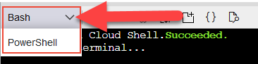
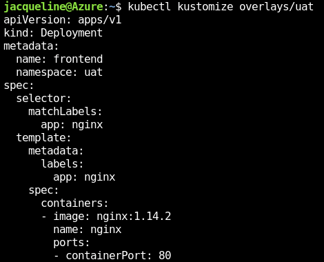
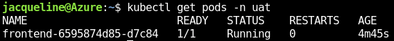
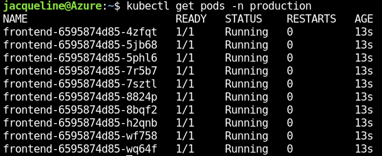

# AKS Workshop Kustomize

## Introduction

Kubernetes relies on YAML files for deployment definitions. As applications grow and more services, application and namespaces are added, these YAML definitions can become hard to manage. 

[kustomize](https://kustomize.io/#overview) is built-in to kubectl and assists in managing templates.

The main concepts in Kustomize are "base" and "overlays" ([terms](https://kubectl.docs.kubernetes.io/references/kustomize/glossary/)). The idea is to have a "base" desired state that might include deployments, services and ingresses. Built on top of the base templates, you can then create multiple overlay templates that extend or modify the base template for a specific environment. 

Below is an example of a Kustomize directory structure:

```
base
├── frontend-deployment.yaml
└── kustomization.yaml
overlays
├── production
│   ├── scale.yaml
│   └── kustomization.yaml
└── uat
    └── kustomization.yaml
```

This module will guide you through the tutorial below to give you hands-on experience configuring and using Kustomize to templatize a YAML workload.

## Tutorial: Deploy ngnix

_(5 minutes)_

In this tutorial, you will deploy a web server. The workload is a simple NGNIX container with no customizations. 

### Step-by-step instructions

To complete this lab, you'll use the Azure Cloud Shell. It's an interactive, authenticated, browser-accessible shell for managing Azure resources, including AKS. Conveniently, it's built into the Azure portal and is preloaded with many of the Azure libraries you will need. It provides both a Bash and PowerShell CLI experience.

Logon to the [Azure Portal](https://ms.portal.azure.com/). Once loaded, open up an Azure Cloud Shell session by clicking on the Cloud Shell icon in the top navigation menu as shown in figure 2.


**Figure 2**. Azure Cloud Shell launch icon

Next, select the **Bash** CLI from the drop-down list box in the upper left-hand corner as shown below in Figure 3.


Use the following command to load identity credentials for your AKS cluster. You will need to provide your resource group and cluster name.

```bash
az aks get-credentials --resource-group RG-NAME --name CLUSTERNAME --admin
```

## Tutorial: create the base desired state

Create a folder named base and cd to it:

```bash
cd # to make sure you are in your home folder
mkdir -p base && cd base
```

Copy and paste the following command and hit enter: 

```bash
cat > frontend-deployment.yaml <<EOF
apiVersion: apps/v1
kind: Deployment
metadata:
  name: frontend
spec:
  selector:
    matchLabels:
      app: nginx
  template:
    metadata:
      labels:
        app: nginx
    spec:
      containers:
      - name: nginx
        image: nginx:1.14.2
        ports:
        - containerPort: 80
EOF
```
This will create a frontend-deployment.yaml in the base directory.
Next, add the deployment to the cluster.

```bash
# Just in case switch to the default namespace
kubectl config set-context --namespace default --current

# Apply deployment to the cluster
kubectl apply -f frontend-deployment.yaml

# List the pod that was created, make sure they are created and running
kubectl get pods
```

Now that we checked that the yaml works as expected, let's delete the deployment:

```bash
kubectl delete -f frontend-deployment.yaml
```

We will use frontend-deployment.yaml as a baseline. 
We need to add a kustmization.yaml file in the base folder. It describes which resources are used.

```bash
cat > kustomization.yaml <<EOF
apiVersion: kustomize.config.k8s.io/v1beta1
kind: Kustomization
  
resources:
  - frontend-deployment.yaml
EOF
```


### Summary

In this tutorial, we deployed an nginx webserver as our baseline for our kustomize project. We created a base folder and added a kustomization file to indicate our base resources.

## Tutorial: Create a UAT environment template

_(15 minutes)_

In this tutorial you will see how a kustomize customization allows us to easily manage namespaces and other properties.

A quick word on [namespaces](https://kubernetes.io/docs/concepts/overview/working-with-objects/namespaces/). Namespaces are commonly used to isolate deployment and services. It is a recommended practice to isolate your workloads by namespace.

The basics steps include:

- Create a uat namespace
- Create an overlays/uat directory
- Create a kustomization.yaml file to contain changes you wish to make
- Deploy to file or cluster

```bash
# Create a new namespace for UAT
kubectl create ns uat

# View your current namespaces
# You should now see UAT in the list
kubectl get ns

# Create a directory to hold your base image and copy the frontend-deployment.yaml file to it. This file will be our "base" template.
cd 
mkdir -p overlays/uat && cd overlays/uat

# Create a new file named kustomization.yaml. Note that type, or kind,
# is a Kustomization. The change you wish to make is renaming the namespace
# in the new deployment to UAT.
cat > kustomization.yaml <<EOF
apiVersion: kustomize.config.k8s.io/v1beta1
kind: Kustomization

namespace: uat

resources:
  - ../../base
EOF
```

We are now going to test/debug the customization.

```bash
# Return to root of project
cd

# Confirm you are in the root of your project (one directory above the UAT folder) and run
kubectl kustomize overlays/uat
```

You will see the following output. Note the namespace is uat.



You can persist the output by running `kubectl kustomize overlays/uat > output.yaml`

Apply the customization directly to the cluster (note the -k option)

```bash
kubectl apply -k overlays/uat

# Look for pods in the root namespace
# None should be visible
kubectl get pods

# Look for pods in the UAT namespace
# Pods are now visable, port forward if you would like to connect to pods
kubectl get pods -n uat
```




### Summary

In this step you learned about isolating deployments in their own namespaces with Kustomize. You extended the base template by creating an overlay template with a different namespace, UAT. You also learned how to display and persist the customized template. You also deployed the customization directly to the cluster.

## Tutorial: Create production environment template, namespace and scale

_(15 minutes)_

In this step, you will create a production namespace, deploy and scale the base template.

The steps include:

- Create an overlays/production directory
- Create a kustomization.yaml file to contain the changes
- Deploy to file or cluster

```bash
# Create a new namespace for UAT
kubectl create ns production

# View your current namespaces
# You should now see production in the list
kubectl get ns

# In our overlays folder, create a production folder
cd # change to your home folder
mkdir -p overlays/production && cd overlays/production
```


```bash
# Create a kustomization file named kustomization.yaml with the following directives:

cat > kustomization.yaml <<EOF
resources:
- ../../base

namespace: production

patches:
- path: scale.yaml
EOF

# Create a new yaml named scale.yaml. Add the following directives:
cat > scale.yaml <<EOF
apiVersion: apps/v1
kind: Deployment
metadata:
  name: frontend
spec:
  replicas: 10
EOF

# Navigate back your home folder
cd

# Write customizations to screen. Note that the number of replicas are 10 and the namespace is production.
kubectl kustomize overlays/production

# Deploy to cluster
kubectl apply -k overlays/production

# Look for pods in the Production namespace
# Pods are now visable and scaled to 10 in the production namespace
kubectl get pods -n production
```
The output should be like this:



### Summary

In this tutorial, you created a new production overlay template and merged it into a scale.yaml template to scale the cluster. UAT and Production are usually similar but different in scale. kustomize helps keep the namespaces and yamls more manageable.


