# Securing AKS With AAD pod-managed identities

## Introduction

In the [Securing AKS With Azure RBAC](../Security-with-RBAC/README.md) section of this workshop, you integrated the AKS cluster with **Azure Active Directory (AAD)** and assigned Kubernetes roles to users and groups in AAD. This section is focused on integrating applications running on AKS with AAD. In azures, while individual use user accounts, applications use service principals. Applications can use this to authenticate to AAD and get access to Azure resources such as PaaS databases, Azure Blob Storage, Azure Key Vault or even other applications you developed that are integrated with AAD.

In this section, we will be focusing on **Managed Identities** which is a functionality that makes authentication to a service principal easier. It works by assigning an identity to a compute resource on Azure such as a Virtual Machine (VM) or Azure Functions. These resources can authenticate using that managed identity through an endpoint that is only accessible from that machine. 

**Azure AD pod-managed identities** allows you to assign managed identities to pods in Kubernetes. Since pods in Kubernetes run on VMs, by default, each pod would be able to access the managed identity endpoint and authenticate using that identity. Using Azure AD pod-managed identities, pods can no longer reach the internal endpoint designated for the VM and would rather only be able to get access through identities assigned to that specific pod.

In this section we will be going over the following:

1. Updating your cluster so that it has Azure AD pod-managed identities feature 
2. Linking an identity to your cluster
3. Using a pod with managed identity

For more indept details of how AAD pod-managed identities work please refer to Chapter 9 of the third edition of the book [Hands-on Kubernetes on Azure](https://www.packtpub.com/product/hands-on-kubernetes-on-azure-third-edition/9781801079945). 

## Turning on Azure AD pod-managed identity feature in AKS cluster

1. Assuming you have the environment variables defined and the AKS preview feature added for Azure CLI in the setup section of this workshop, Register the `EnablePodIdentityPreview` feature

   > Note that for this section, you need to be using an Azure tenant with AAD instance where you have  global administrator permissions. If you don't have one please create [a free account here](https://azure.microsoft.com/en-ca/free/search/?OCID=AID2100017_SEM_64fae88fcd6f1197e6ee88294daa302c:G:s&ef_id=64fae88fcd6f1197e6ee88294daa302c:G:s&msclkid=64fae88fcd6f1197e6ee88294daa302c) and deploy an AKS cluster **with Azure CNI** before preceding. It doesn't have to be the AKS workshop cluster.

   ```bash
   az feature register --name EnablePodIdentityPreview \
   	--namespace Microsoft.ContainerService
   ```

2. Update the fruit smoothie AKS cluster with Azure CNI to include pod-managed identity. 

   ```bash
   az aks update -g $RESOURCE_GROUP -n $AKS_CLUSTER_NAME --enable-pod-identity
   ```

3. Ensure that the pod identity preview is registered in your subscription by entering the command below

   ```bash
   az feature show --name EnablePodIdentityPreview \
   --namespace Microsoft.ContainerService -o table
   ```

   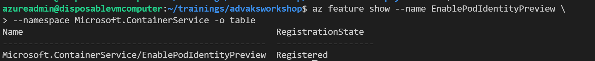

4. Obtain credentials to access your cluster and verify that you have access

   ```bash
   az aks get-credentials -g $RESOURCE_GROUP \
    -n $AKS_CLUSTER_NAME --overwrite-existing
   ```

   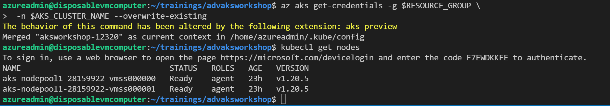


Linking a Managed Identity to your cluster

1. In the search bar in Azure portal search for *managed identity* and select **Managed Identities**

   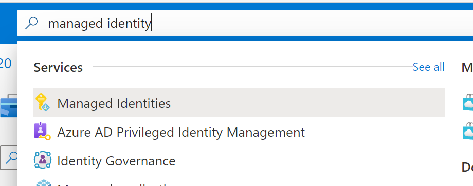

2. Click **+ New** in the next screen and fill in details about your new managed identity. It is recommended you create a new resource group for this so that they can easily be cleaned up at the end of the chapter

   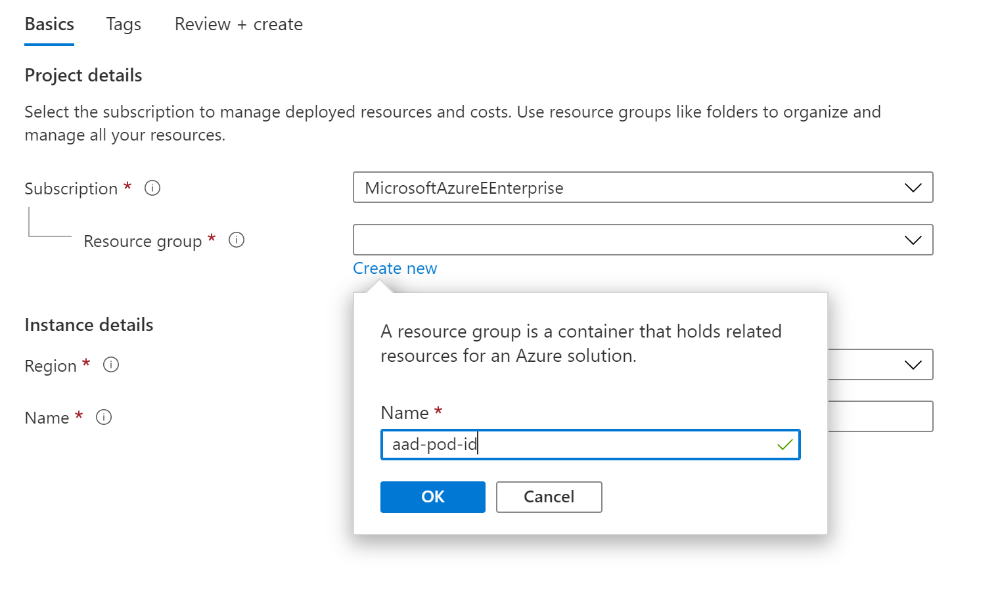

3. Select the region you deployed your cluster in and enter a name for your managed identity. In this case we used *access-blob-id* as the name of the Managed identity. Click **Review + create** button and in the final window click **Create** button.

4. Once the resource has been provisioned, click on **Go to resource**. Copy the **Client ID** in the overview page, you will need that later.

   ```bash
   CLIENT_ID=<client id>
   ```

5. Select **Properties** in the left pane and copy the **Resource ID**

   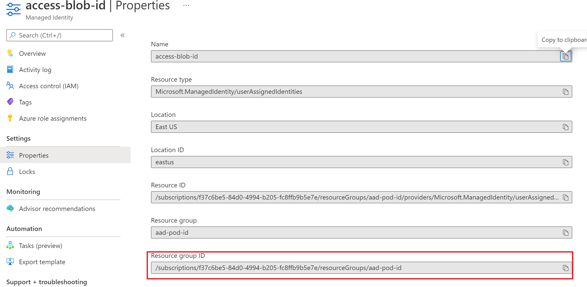

   ```bash
   RESOURCE_ID="<resource id>"
   ```

6. Link the managed identity to your AKS cluster

   ```bash
   az aks pod-identity add --resource-group $RESOURCE_GROUP \
   --cluster-name $AKS_CLUSTER_NAME --namespace default \
   --name access-blob-id \
   --identity-resource-id $RESOURCE_ID
   ```

7. You should be able to verify your identity has been successfully linked with the cluster

   ```
   kubectl get azureidentity
   ```

   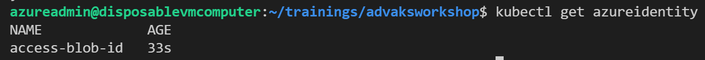

## Use a pod managed identity to access an Azure Resource

In this section we will use the pod managed identity linked to the cluster to interact with a new blob storage account

### Create storage account

1. Search for storage account in the search bar at the top of the Azure portal and select **Storage accounts**

2. Click the **+ New** button at the top of the screen. Select the *aad-pod-id* resource group you created earlier , give the account a unique name and select the same region as your cluster. Fill in the rest of the fields as shown in the picture below

   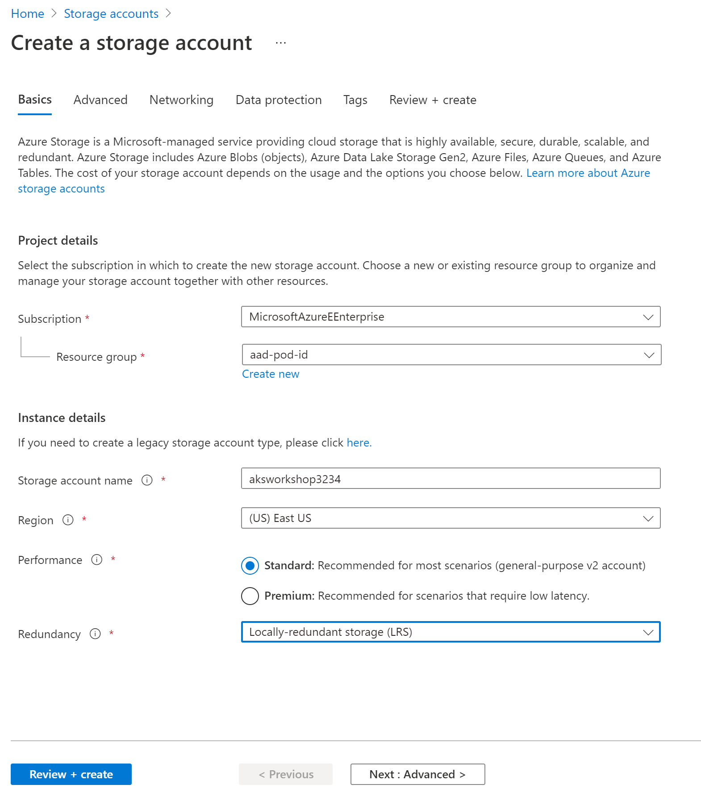

3. Click on **Review + create** then click on **Create**. After the resource has been provisioned, click on **Go to resource**.

### Grant access to the Storage Account and Upload File

1. Within the resource page, click on **Access Control (IAM)** on the left pane

2. Click on **+ Add** at the top of the screen and then click **Add role assignment**

3. Select the **Storage Blob Data Contributor** role  in the *Role* field

4. Set the *Assign access to* field to **User assigned managed identity**

5. Select the managed identity you created

   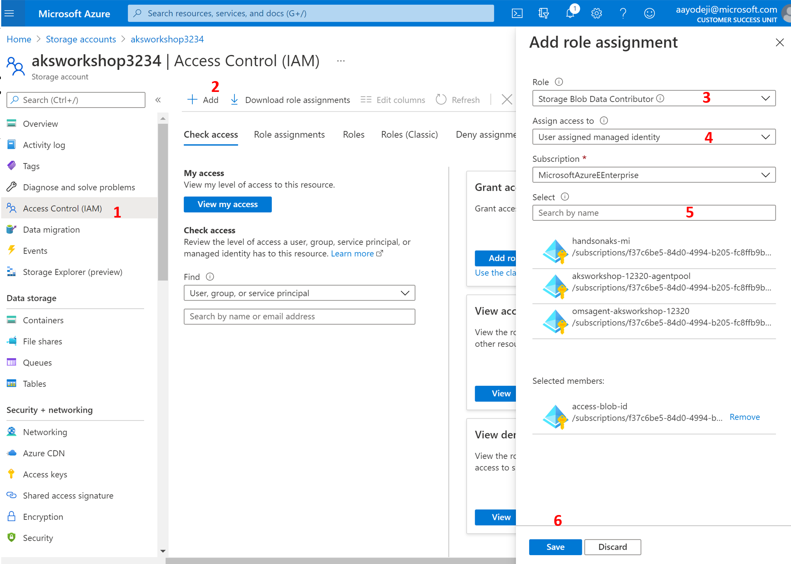

6. To upload a file go to the storage account overview pane and click on **Blog Service**. 

7. Click **+ Container** and add a name for the container then click create at the bottom

   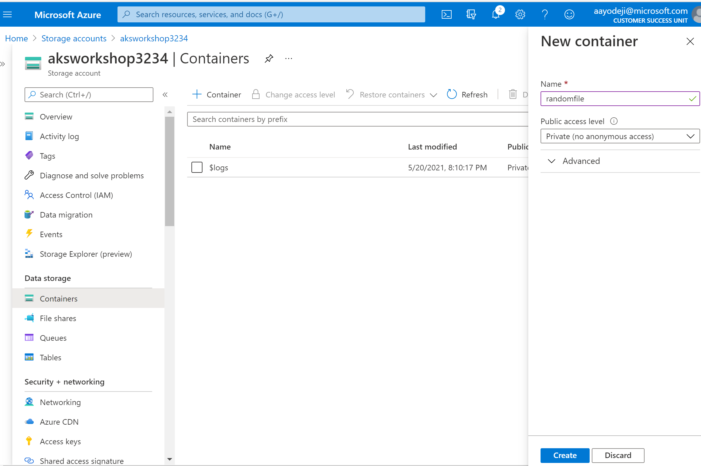


8. Click upload at the top left of the resulting page then select a random file in your computer to upload. Click **Upload**.

   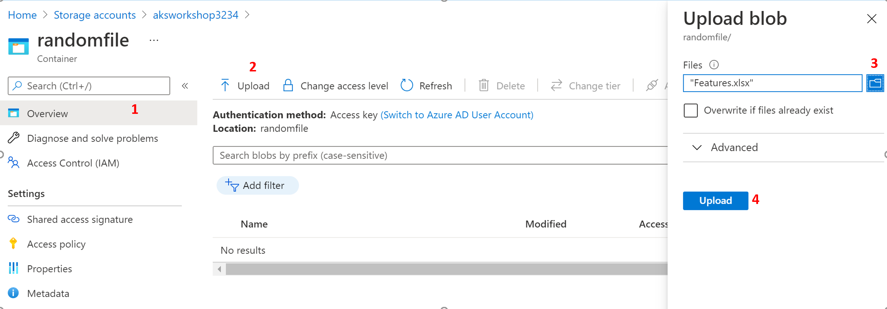

Now that the storage account has been created and linked to our cluster, we can go ahead and test this feature.

### Accessing the pod from the cluster

1. To try and connect to the storage account, we will deploy a new pod created using the Azure CLI container image. Create a new file in your working directory. You can use your preferred editor.

   ```bash
   code deployment‑with‑identity.yaml
   ```

2. Copy the manifest file code below into the file you just created and save it

   ```yaml
   apiVersion: apps/v1
   kind: Deployment
   metadata:
     name: access-blob
   spec:
     selector:
       matchLabels:
         app: access-blob
     template:
       metadata:
         labels:
           app: access-blob
           aadpodidbinding: access-blob-id
       spec:
         containers:
         - name: azure-cli
           image: mcr.microsoft.com/azure-cli
           command: [ "/bin/bash", "-c", "sleep inf" ]
   ```

3. Create this deployment using the following command

   ```bash
   kubectl create -f deployment‑with‑identity.yaml
   ```

4. When the pod is in the *Running* state copy run the code below replacing the items in the angle brackets with the name of the access-blob pod

   ```bash
   kubectl exec -it <access-blob pod name> -- sh
   ```

5. Within the container's terminal, enter the command below

   ```bash
   az login --identity -u <client ID of managed identity> \
   	--allow-no-subscription -o table
   ```

6. This should return an output similar to this picture below

   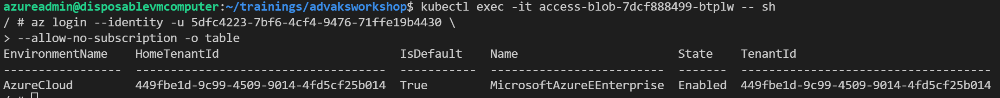

7. Now you can try accessing the blob storage account and downloading the file

   ```bash
   az storage blob download --account-name <storage account name> \
   	--container-name <storage container name> --auth-mode login \
   	--file <filename> --name <filename> -o table
   ```

   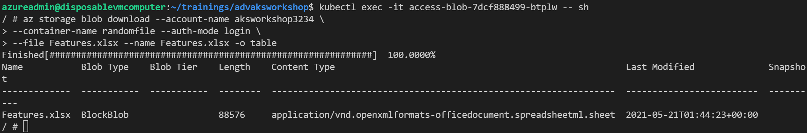

8. You can exit the container using the *exit* command. Next we will verify that pods that don't have a managed identity linked to the private storage account you created. Create a new manifest file.

   ```bash
   code deployment-without-identity.yaml
   ```

9. Copy and paste the code below into the file and save it

   ```bash
   apiVersion: apps/v1
   kind: Deployment
   metadata:
     name: no-access-blob
   spec:
     selector:
       matchLabels:
         app: no-access-blob
     template:
       metadata:
         labels:
           app: no-access-blob
       spec:
         containers:
         - name: azure-cli
           image: mcr.microsoft.com/azure-cli
           command: [ "/bin/bash", "-c", "sleep inf" ]
   ```

10. Create the new pod using the same image but without access to the managed identity called no-access- blob

    ```bash
    kubectl create -f deployment-without-identity.yaml
    ```

11. Get the name of the new pod when it is in the *Running* state

    ```bash
    kubectl get pods -l app=no-access-blob
    ```

12. Log into this pod using the command below

    ```bash
    kubectl exec -it <no-access-blob pod name> -- sh
    ```

13. Try to authenticate to the Azure API using the command below

    ```bash
    az login --identity -u <client ID of managed identity> \
    	--allow-no-subscription -o table
    	
    az login --identity -u 5dfc4223-7bf6-4cf4-9476-71ffe19b4430 \
    	--allow-no-subscription -o table
    ```

14. The authentication fails this time as expected. Use the *exit* the command to exit the container.

    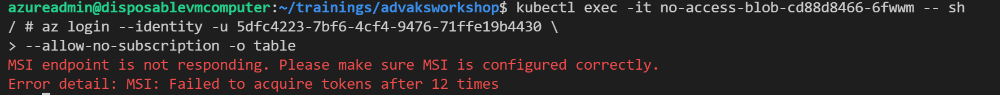

You have shown how to use Azure AD pod-managed identities to connect to an Azure resource outside the cluster. This concludes this section.


## Cleanup

1. Run the command below to delete the resources you created

   ```bash
   az aks pod-identity delete --resource-group $RESOURCE_GROUP \
   	--cluster-name $AKS_CLUSTER_NAME --namespace default \
   	--name access-blob-id
   
   az group delete -n aad-pod-id --yes
   
   kubectl delete -f .
   ```

## Next step

:arrow_forward: [Storing Secrets Securely with Azure Key Vault](../Storing-secrets-securely/README.md) 