# Securing AKS With Azure RBAC

## Introduction

During the workshop, you used a global permission to access and make changes to the cluster. In production clusters, it is recommended that **role-based access control (RBAC)** is used to only allow limited access to users that they need to complete their jobs using the **Principle of least privilege (PoLP)**. In this section, we will configure RBAC and integrate it with **Azure Active Directory (AAD)**. This will ensure that the organization policies applied to AAD would also be effective for users accessing the cluster. This is an important topic because it helps restrict access by attackers and unintentional downtime due to accidental deletion or modification of resources in the cluster.

This is generally safer than using a different address space for users in AKS which is the default. In this section we will be completing the following:

1. Creating a user and user group in AAD connected to the cluster
1. Configuring RBAC in AKS
1. Disable local accounts
1. Configure conditional access
1. Configure just-in-time cluster access 

> Note that for this section, you need to be using an Azure tenant with AAD instance where you have global administrator permissions. If you don't have one, please create [a free account here](https://azure.microsoft.com/en-ca/free/search/?OCID=AID2100017_SEM_64fae88fcd6f1197e6ee88294daa302c:G:s&ef_id=64fae88fcd6f1197e6ee88294daa302c:G:s&msclkid=64fae88fcd6f1197e6ee88294daa302c) and deploy an AKS cluster before preceding. It doesn't have to be the AKS workshop cluster.

In Kubernetes RBAC there are three important concepts

1. **Role** is a set of permissions for example, get, watch, list. It defaults to no permissions and every permission needs to be explicitly added and is restricted to a specific namespace
2. **Subject** is either the person or service principal that is assigned the role
3. **Role binding** links a subject to a rule in a specific namespace

Cluster roles and cluster role bindings work similarly except they provide permission across all namespaces in the cluster. In this workshop you will be skimming through the process of securing AKS with Azure RBAC. For more details about how to do this please check out Chapter 8 of the third edition of the free book, [Hands-on Kubernetes on Azure](https://aka.ms/handson-aks-book).

## Enabling AAD integration in your AKS Cluster

In this section we will be creating a user group and enabling Azure AD integration with the AKS cluster. Once a cluster has been integrated with Azure AD, this functionality cannot be disabled.

### Create an AAD Group

1. Search for AAD in the top search bar and select Azure Active Directory

1. In the left plane, select **Groups**

1. Click **+ New Group** at the top 

1. In the next page create a security group and give it a name and description. Select your user as the owner and a member of this group. Click **Create** button at the bottom of the screen

   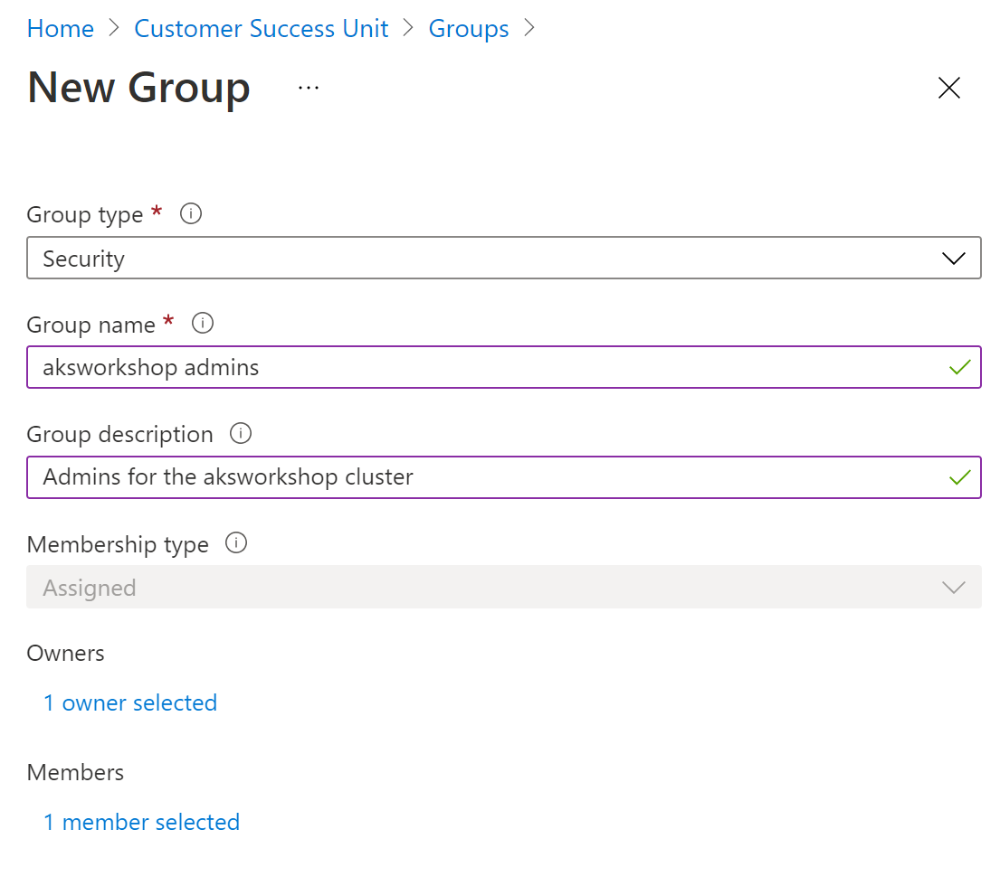
   
1. With the group now created, search for your aks cluster and select it

   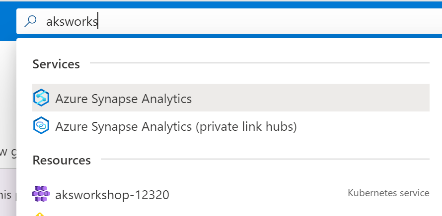

1. In the pane to the left select **Cluster configuration** under **Settings**

1. Enable **AKS-managed Azure Active Directory**

1. Click **+ Add Azure AD groups as administrators on this cluster**

1. Find the user group you just created and select it

1. Click select at the bottom

1. Click **Save** at the top of the screen

    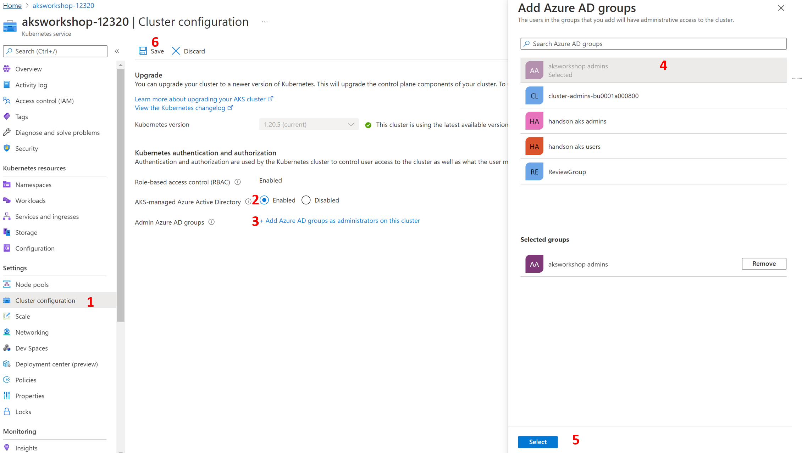

### Create a user and group assignment in AAD

In this section you will create a user that you will assign permissions to for your AKS cluster

1. Type AAD in the search bar at the top of the screen and select Azure Active Directory

1. Click on **Users** in the left pane

1. Click on **+ New user** at the top of the resulting screen

   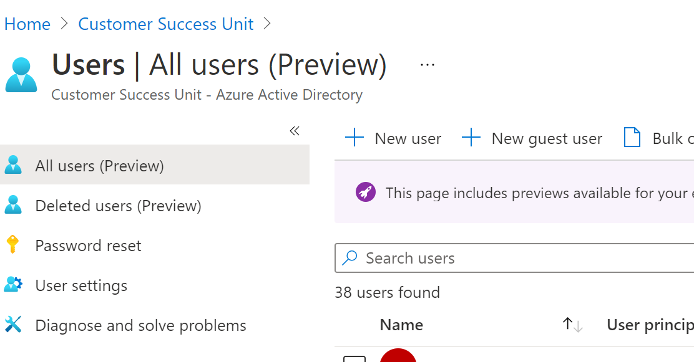

1. Provide information about the user including the username. Note down the password and click **Create**

   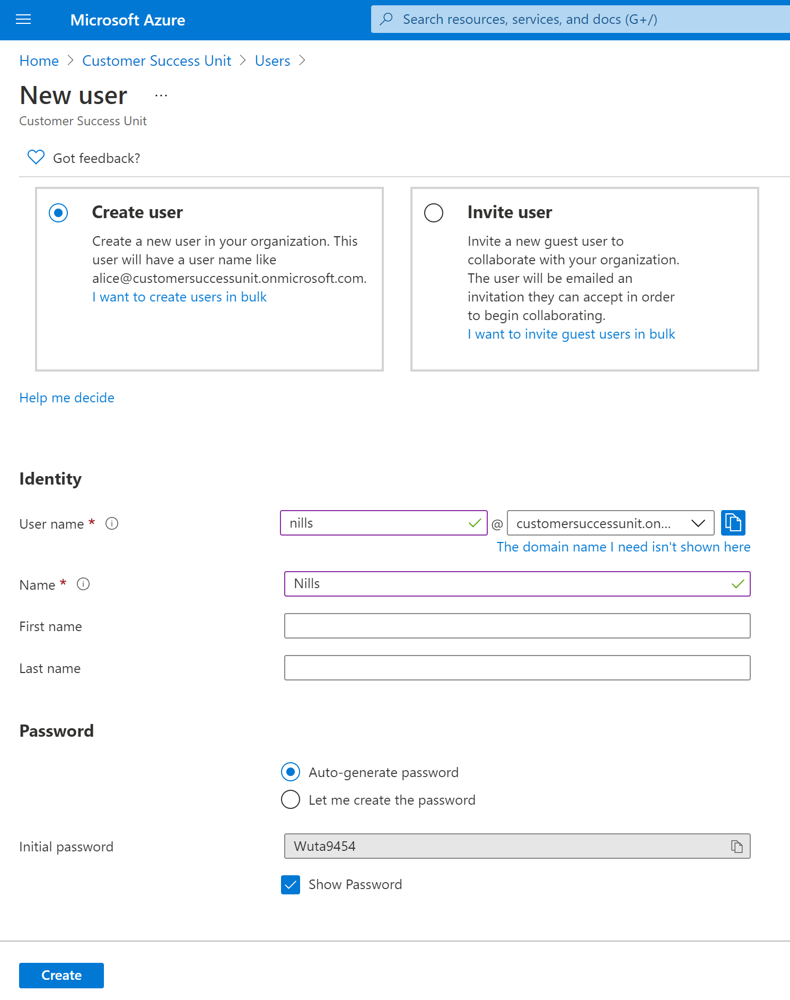

1. Now that the user is created go back to the AAD pane and select **Groups** then click on **+ New group**

1. Enter details about this new user group and add the newly created user as a member of the group

   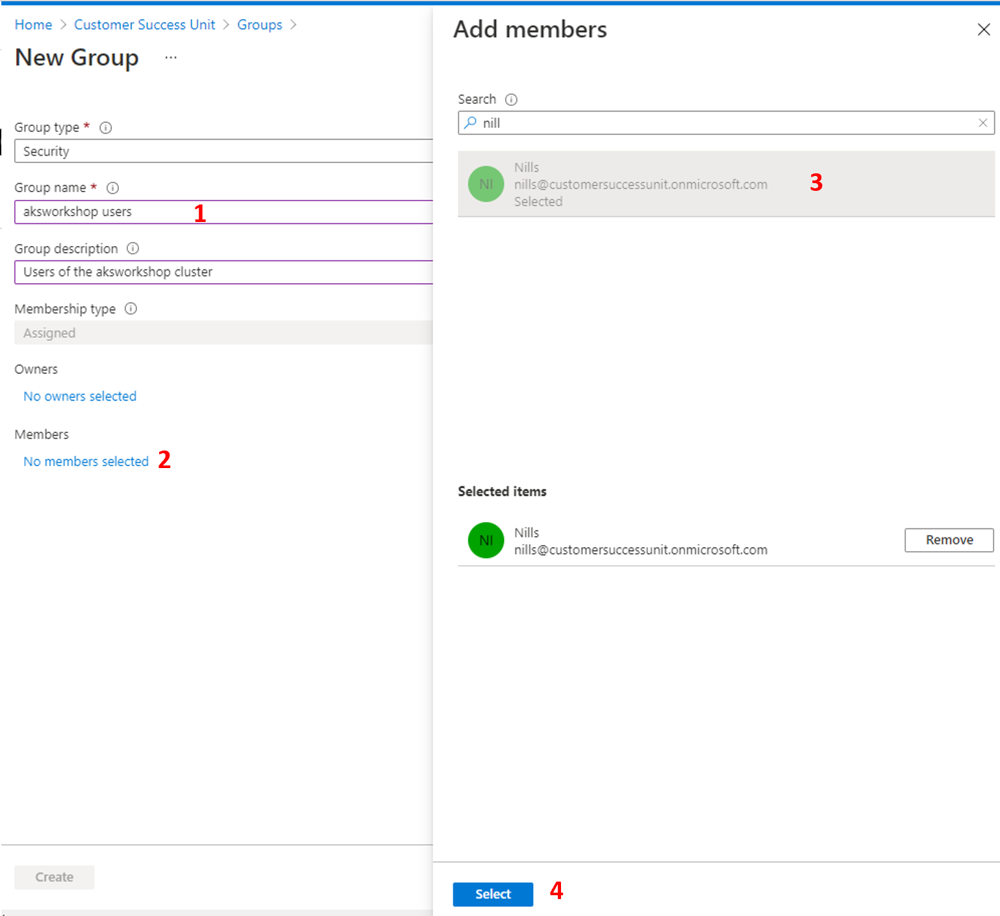

1. Head back to your cluster following the same steps above

   

1. Click on **Access control (IAM)** in  the left pane then click **+ Add** button and select **Add role assignment** 

1. In the resulting pane select **Azure Kubernetes Services Cluster User Role** for the **Role** field and then select your new user in the **Select** field then click **Save**

   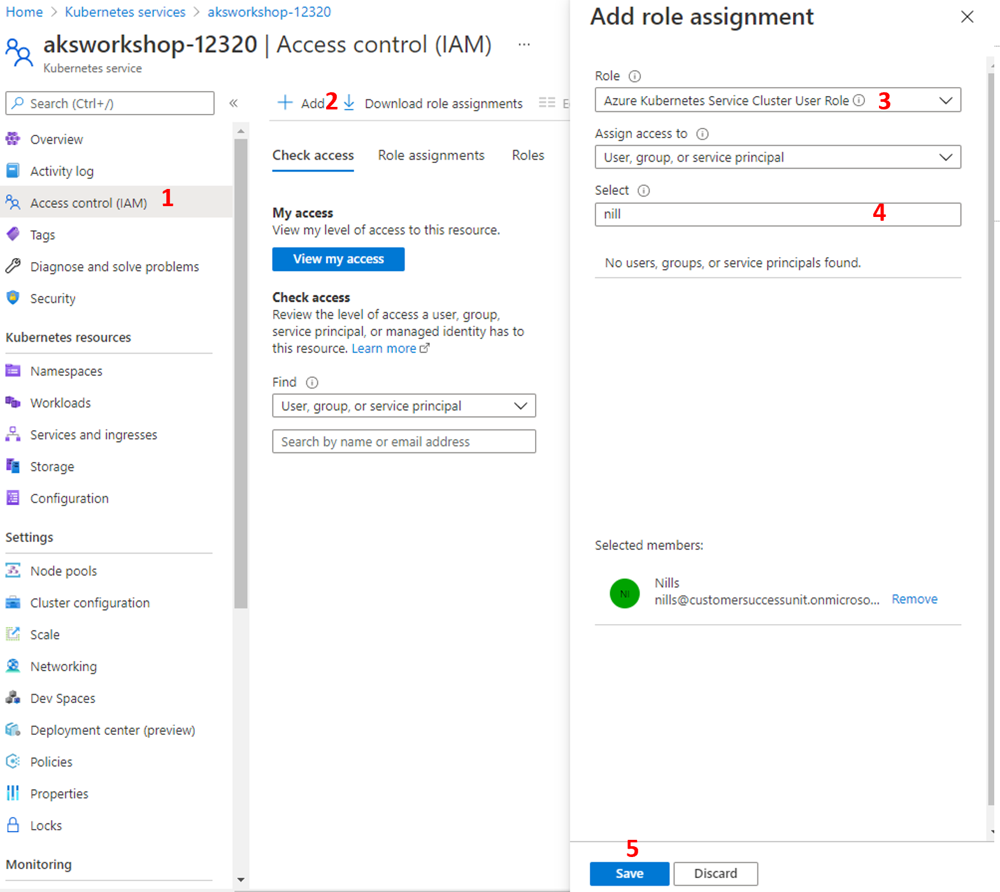

This concludes setting up AAD RBAC for the cluster.

### Grant User group Access to Storage Account

In this section we will create a storage account to test our RBAC

1. Type *storage* in the search bar at the top of the screen in Azure Portal and select **Storage accounts**

1. Click on the resource group that starts with **cloud-shell-storage**

   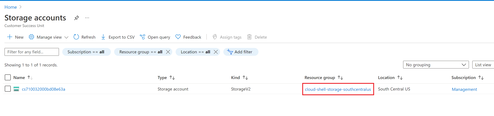

1. Select **Access control (IAM)** in the resulting pane then click **+ Add** 

1. Select **Storage Account Contributor** to the role field and then select the user group you just created for your the user you created

   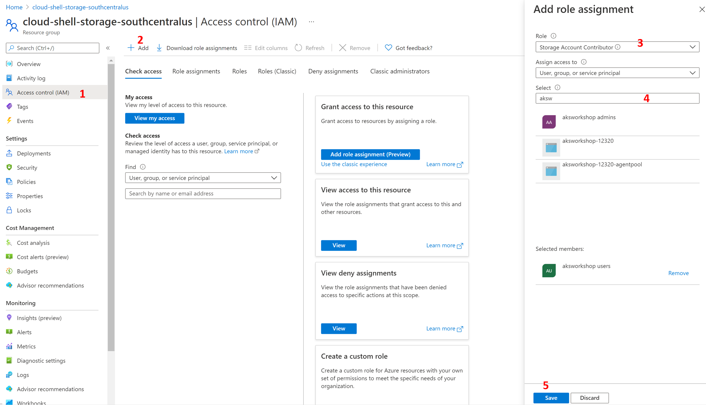

### Configure RBAC in AKS

We begin by setting up our terminal we need to begin by completing the following steps. Setup environment variables and get credentials for your AKS cluster if you haven't already.

```bash
REGION_NAME=eastus
RESOURCE_GROUP=aksworkshop
SUBNET_NAME=aks-subnet
VNET_NAME=aks-vnet
AKS_CLUSTER_NAME=<cluster name>
AKS_CLUSTER_NAME=aksworkshop-12320
```

```bash
az aks get-credentials \
--resource-group $RESOURCE_GROUP \
--name $AKS_CLUSTER_NAME
```

Clone the repository we will be using if you haven't already.

```bash
git clone https://github.com/mosabami/aks-adv-workshop-yaml-files
cd ./aks-adv-workshop-yaml-files/rbac-yaml-files
```

Next we will create two namespaces and deploy applications onto them to test out RBAC in AKS

Get the group ID of the group you created for users and save it in a variable

```bash
USER_GROUP_ID=$(az ad group show -g 'aksworkshop users' \
--query objectId -o tsv)
```

Next we create the namespaces

```bash
kubectl create ns no-access
kubectl create ns delete-access
```

Next we deploy the azure-vote application in both namespaces

```bash
kubectl create -f azure-vote.yaml -n no-access
kubectl create -f azure-vote.yaml -n delete-access
```

Next you create the ClusterRole object

```bash
kubectl create -f clusterRole.yaml
```

Next create the ClusterRoleBinding object. You will need to modify the *clusterRoleBinding.yaml* file and add your user group id to the name parameter at the bottom of the file. Start by copying the user group ID

```bash
echo $USER_GROUP_ID
```

Copy the user ID and open the file to modify it

```
code clusterRoleBinding.yaml
```

Modify the file and replace the "<group-id>" field with your user group id. Save the file and exit to the terminal. 

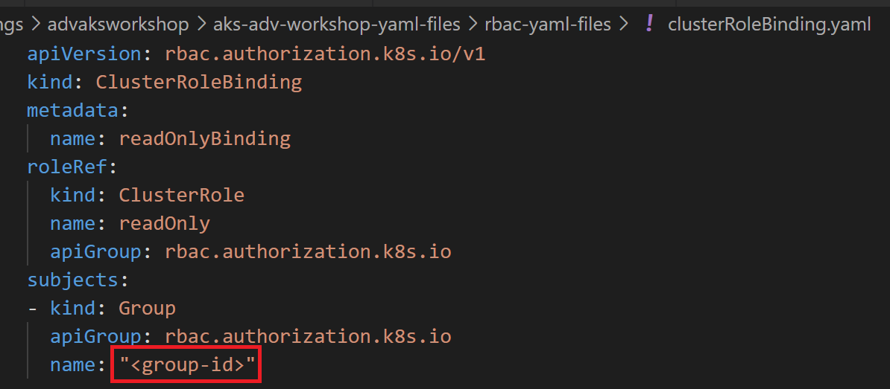

```bash
kubectl create -f clusterRoleBinding.yaml
```

Next you will create a role that is limited to the delete-access namespace. This will allow the user delete pods within the delete-access namespace. This time we are defining a role as opposed to the ClusterRole that was created in the previous steps

```bash
kubectl create -f role.yaml
```

Finally we will be creating a role binding  to link the delete access role to the user we just created. This file also needs to be modified. 

```bash
code roleBinding.yaml
```

This time replace the <user e-mail address> with the email address of the user you created. This shows how to bind a role to a user as opposed to a user group. Save the file and exit to the terminal.

Next create the role binding

```bash
kubectl create -f roleBinding.yaml
```

This concludes setting up roles and role bindings for this new user with limited access to managing resources in the cluster. In the next section we will test it out.

## Disable Local Accounts

When deploying a cluster, local accounts are enabled by default. Even when enabling RBAC or Azure Active Directory integration, `--admin` access still exists, essentially as a non-auditable **backdoor** option. For added security, AKS offers the ability to disable local accounts via a flag, `disable-local`.

To use an AKS cluster without local accounts, you must enable the `DisableLocalAccountsPreview` feature flag on your subscription.

Before we start, try logging in with the `--admin` flag to show that the default cluster has it enabled.

```bash
az aks get-credentials --resource-group $RESOURCE_GROUP --name $AKS_CLUSTER_NAME --admin
```

You should see a response similar to the picture below


At the time of writing this, this feature was in preview. Run the command below to enable this preview feature.

```bash
az feature register --namespace "Microsoft.ContainerService" --name "DisableLocalAccountsPreview"
```

Wait for the feature to be registered which would take a few minutes. You can check the status by running the following command.

```bash
az feature list -o table --query "[?contains(name, 'Microsoft.ContainerService/DisableLocalAccountsPreview')].{Name:name,State:properties.state}"
```

After a few minutes, you should see the registered status looking similar to this:


When it is ready, refresh the registration of the *Microsoft.ContainerService* resource provider using the [az provider register](https://docs.microsoft.com/cli/azure/provider#az_provider_register) command:

```bash
az provider register --namespace Microsoft.ContainerService
```

Finally we disable local accounts in our existing cluster.

```bash
az aks update -g $RESOURCE_GROUP -n $AKS_CLUSTER_NAME --disable-local
```

Your output should include the following:

```json
"properties": {
    ...
    "disableLocalAccounts": true,
    ...
}
```

Now attempt to get admin credentials again and this request should fail.

```
az aks get-credentials --resource-group $RESOURCE_GROUP --name $AKS_CLUSTER_NAME --admin
```

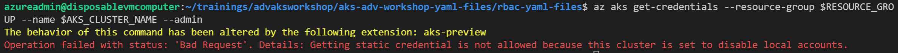

You can re-enable it using the following command.

```bash
az aks update -g $RESOURCE_GROUP -n $AKS_CLUSTER_NAME --enable-local
```

Your output should include the following:

```json
"properties": {
    ...
    "disableLocalAccounts": false,
    ...
}
```

## Test RBAC in AKS

In this section we will test out our RBAC.

1. If you are using a terminal, open a new terminal. If you are using Azure cloud shell, log into the Azure portal in a different browser (or InPrivate window of the same browser) using the user you created's credentials.

1. Enter the following to log into the correct tenant **as the user you just created**. Follow the instructions to get logged into the account. 

   ```bash
   az login -t <tenant id>
   ```

1. Enter the following to log into your Kubernetes cluster

   ```
   REGION_NAME=eastus
   RESOURCE_GROUP=aksworkshop
   SUBNET_NAME=aks-subnet
   VNET_NAME=aks-vnet
   AKS_CLUSTER_NAME=<cluster name>
   az aks get-credentials -n $AKS_CLUSTER_NAME -g $RESOURCE_GROUP
   ```

1. Try a *kubectl* command to verify your access. 

   ```bash
   kubectl get nodes
   ```

   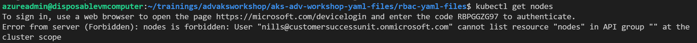

   You get a Forbidden error message informing you that you don't have access. This means that RBAC is working since this user was only configured to have access to pods.

1. Ensure your user has access to view all pods

   ```bash
   kubectl get pods -n no-access
   kubectl get pods -n delete-access
   ```

   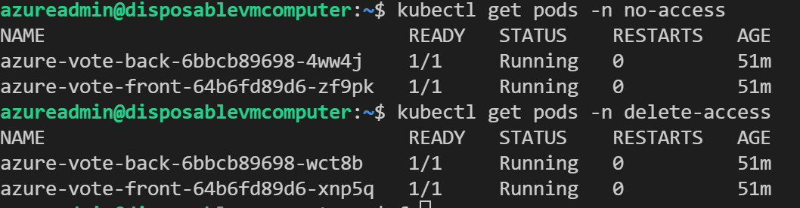

1. Check to see that your user has permission to delete pods in the delete-access namespace based on our defined roles and rolebindings. You will find that you have permission to based on the configuration deployed earlier

   ```bash
   kubectl delete pod --all -n delete-access
   ```

   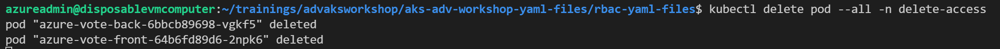

1. Let us test delete permissions to delete pods in the no-access namespace. You will find that you do not have permission because there was no role permission defined in that namespace. It denies access by default until a permission is explicitly configured.

   ```
   kubectl delete pod --all -n no-access
   ```

   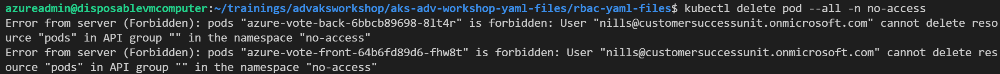

In this section, you verified the functionality of RBAC in AKS clusters. 

## Use Conditional and JIT Access with Azure AD

To further enhance the security of your cluster you can use Azure AD with conditional access and Azure AD with just in time access. These options require Azure AD Premium capability. For more details click on the links below:

* [Conditional Access](https://docs.microsoft.com/azure/aks/managed-aad#use-conditional-access-with-azure-ad-and-aks)
* [Just in time Access](https://docs.microsoft.com/azure/aks/managed-aad#configure-just-in-time-cluster-access-with-azure-ad-and-aks)

## Cleanup

Now we go ahead and decommission the workloads. Run the following commands with your main user account that has all the required access.

```bash
kubectl delete -f azure-vote.yaml -n no-access
kubectl delete -f azure-vote.yaml -n delete-access
kubectl delete -f .
kubectl delete ns no-access
kubectl delete ns delete-access
```

## Next step

:arrow_forward: [Security with AAD pod-managed identities](../Security-with-AAD-pod-managed-identities/README.md) 
