# Storing Secrets with Azure Key Vault Provider
Kubernetes has a pluggable back end to manage secrets and use them for your deployments. The ability to manage secrets and use them properly will make your applications more secure. Kubernetes has a built-in secret system that stores secrets in a semi-encrypted fashion in the default Kubernetes database. This system works well but isn't the most secure way to deal with secrets in Kubernetes. In AKS, you can use the Secrets Store CSI Driver for Kubernetes. 

In this section we will go over the following:

* Creating and using secrets in Kubernetes
* Enabling the Azure Key Vault provider for secrets Store CSI driver preview feature in your cluster
* Using the Azure Key Vault provider for secrets Store CSI driver

Kubernetes comes with a default secrets implementation whereby these secrets are stored in the etcd database which is where metadata for all objects are stored. These secrets are stored in base64 encoded format which is relatively easy to decrypt. In this section we will be using a more secure method where secrets will be stored in Azure Key Vault instead.

## Secrets in Kubernetes using Default Implementation

Setup environment variables if you haven't already

```bash
REGION_NAME=eastus
RESOURCE_GROUP=aksworkshop
SUBNET_NAME=aks-subnet
VNET_NAME=aks-vnet
AKS_CLUSTER_NAME=<cluster name>
```

Get credentials for your AKS cluster

```bash
az aks get-credentials \
--resource-group $RESOURCE_GROUP \
--name $AKS_CLUSTER_NAME
```


### Creating Secrets

You can create secrets using one of 3 ways

* Creating secrets from files
* Creating secrets form YAML or JSON definitions
* Creating secrets from the command line.

In this section, we will focus on the second option, since the workshop already went over the third option. For more details, check out chapter 10 of the Third Edition of the free book [Hands-on Kubernetes on Azure](https://aka.ms/handson-aks-book).

1. We begin by deleting the secret that was created during the workshop so that we can recreate it using these new methods

   ```bash
   kubectl delete secrets mongosecret --namespace ratingsapp
   ```

   

2. First you need to encode the secret in base64:

   ```bash
   echo 'superSecretToken' | base64
   ```

   you will get the following output

   ```bash
   c3VwZXJTZWNyZXRUb2tlbgo=
   ```

   You can decrypt this so that you can get the original string back easily by running the following

   ```bash
   echo 'c3VwZXJTZWNyZXRUb2tlbgo=' | base64 -d
   ```

   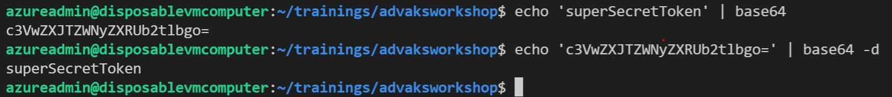

   This shows how easy it is to decrypt secrets stored in the proprietary kubernetes database

3. Next we will encode the secret that was used during the AKS workshop

   ```bash
   echo "mongodb://<username>:<password>@ratings-mongodb.ratingsapp:27017/ratingsdb" | base64
   ```

   this will give you the base-64 encoded URL

   > VERY IMPORTANT: When you copy the output of the previous command amd paste it in the myconnectionstring.yaml file ensure the encoded string is 1 line with no space inbetween. 
   >
   > If it ends with "GIK" replace the last 3 strings with "GI=". 

4. Next you edit the secret definition manifest file manually by adding your encrypted connection string to the file and save it in a file called *myconnectionstring.yaml*. First switch to the appropriate folder for this module. If you haven't already, clone the repo as well. Replace <your encrypted connection string> with your modified encoded string.

   ```
   git clone https://github.com/mosabami/aks-adv-workshop-yaml-files
   ```

   ```bash
   cd aks-adv-workshop-yaml-files/key-vault-yaml-files
   ```

   ```bash
   code myconnectionstring.yaml
   ```

5. Now you can create the secrets using the command below:

   ```bash
   kubectl create -f myconnectionstring.yaml
   ```

6. Run this command to verify the secret was created

   ```bash
   kubectl get secrets
   ```

7. You can also verify that it is the same as the manifest file that created it

   ```bash
   kubectl get secrets mongosecret --namespace ratingsapp -o yaml
   kubectl describe secrets mongosecret --namespace ratingsapp -o yaml
   ```

### Using Secrets

Kubernetes offers two ways of linking your secrets to your application

* Using secrets as environment variables
* Mounting secrets as files

Mounting secrets is the best way to consume secrets in your application and we will go over why

#### Secrets and Environment variables

You can configure a pod with environment variable secrets. This was done during the workshop and we will repeat the steps here using the secret created using the yaml file. We begin by recreating the old deployment manifest file for the  ratings-api which is in the folder you just cloned from GitHub. Edit it with the code below or by using your favorite editor

```bash
code ratings-api-deployment.yaml
```

> Don't forget to replace **<acrname>** in the file below with your ACR name from the AKS workshop. You can verify this by checking your Azure portal and searching for container registries eg acr5398

Delete the old secret from the workshop implementation so that it can be recreated using our new secret

```bash
kubectl delete -f ratings-api-deployment.yaml  --namespace ratingsapp
```

Deploy the ratings-api pods

```bash
kubectl apply \
    --namespace ratingsapp \
    -f ratings-api-deployment.yaml
```

Check to see if the deployment is ready 

```bash
kubectl get deployment --namespace ratingsapp
```

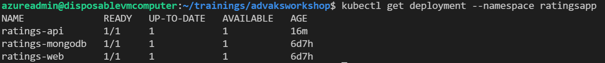

Get the external IP of your service

```
kubectl get svc --namespace ratingsapp
```

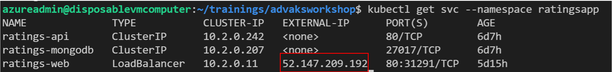

Copy this IP address and paste it in your browser. You should see the app running

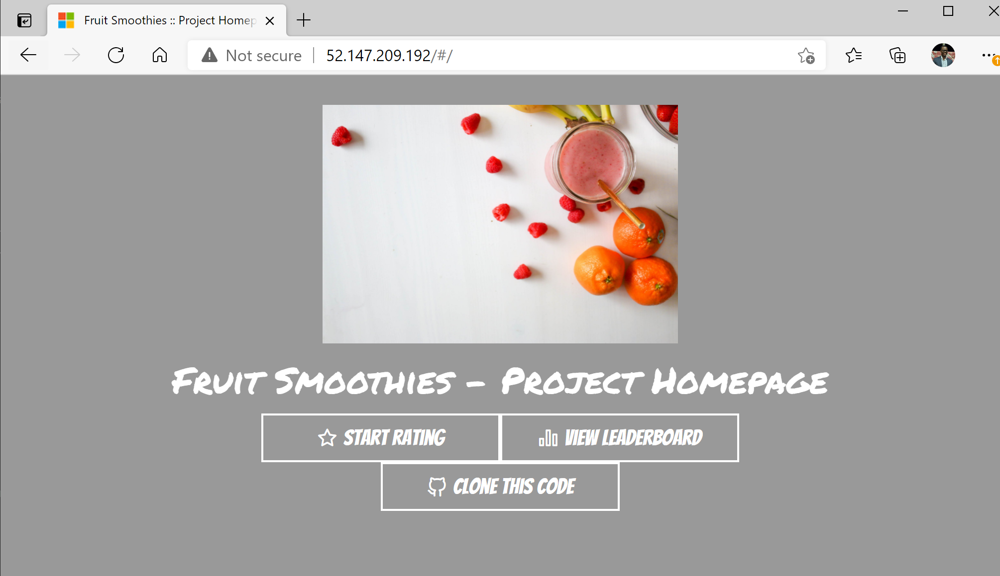

You can check whether the environment variables are set correctly. Start by getting the pod name

```bash
kubectl get pods --namespace ratingsapp
```

Find the pod that starts with ratings-api and copy its name then replace <pod name> in the command below with it:

```bash
kubectl exec -it <pod name> --namespace ratingsapp--- sh
```

You can see that they have been set correctly and are decrypted in the pod. This is because the base64 encoding is only applied at the Kubernetes API level but not at the application level. This is why it is so important to limit access to pods using the options discussed in the RBAC section of this workshop.

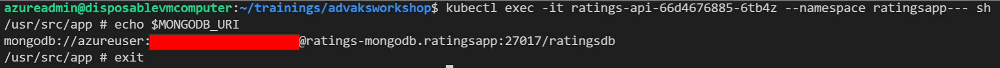

Exit the pod's terminal by entering *exit* command

One thing to note is that any application can use the secret values by referencing the appropriate env variables. There is no way to limit which processes in a container can access which environment variables. The other thing to note is that the value of the environment variable will not be updated when the secret itself is updated. This might cause you to end up in a state where pods that are created after a secret is updated have a different environment variable value compared to the pods created before the secret was updated.

#### Secrets as files

Let's take a look at how to mount the same secrets as files rather than environment variables:

Edit the file *ratings-api-deployment-files.yaml* by replacing <acr name> with your actual ACR name

```bash
code ratings-api-deployment-files.yaml
```

Apps that get secrets as files require special code which is beyond the scope of this workshop, but we can still apply this manifest file in the ratingsapp namespace to see if the secrets got passed to the pod

```bash
kubectl apply -f ratings-api-deployment-files.yaml --namespace ratingsapp
```

Get the pod name using the instructions above for the pod that starts with ratings-api-files and exec into the pod. It should start with **ratings-api-files**

```bash
kubectl get pods -n ratingsapp
```

```bash
kubectl exec -it <pod name> --namespace ratingsapp -- sh
```

CD to the correct folder that matches the mouthPath stated in the manifest file

```bash
cd /etc/secrets/
```

Run this command to get the secret

```bash
cat MONGOCONNECTION
```

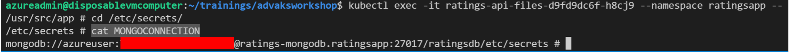

Delete this deployment since it will no longer be used

```bash
kubectl delete -f ratings-api-deployment-files.yaml --namespace ratingsapp
```


#### Why secrets as files is the better of the two

Run the following command to see secrets in plain text in the docker runtime. Get the vmss instance number

```
kubectl get pods --namespace ratingsapp
```

```
kubectl describe pod <ratings-api pod name> -n ratingsapp | grep Node
```

Now get Docker ID of the running pod

```bash
kubectl describe pod <ratings-api pod name> -n ratingsapp | grep 'Container ID' 
```

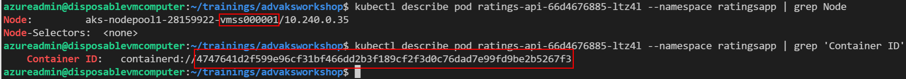

Finally, you will execute a command on the node running your container to show the secret that was passed as an environment  variable. First, let's set a couple of variables you'll use later

```
INSTANCE=<vmss instance number>
DOCKERID=<docker id>
VMSS=$(az vmss list --query '[].name' -o tsv)
RGNAME=$(az vmss list --query '[].resourceGroup' -o tsv)
```

Below is an example of what the first 2 variables should look like

```
INSTANCE=1
DOCKERID=4747641d2f599e96cf31bf466dd2b3f189cf2f3d0c76dad7e99fd9be2b5267f3
```

> The previous command assumes you have a single AKS cluster with one node pool in your subscription. If this is not the  case, please change the values of VMSS and RGNAME to the name of the value of the scale set and resource
> group running your cluster.

Assuming you are using Kubernetes version 1.19 or greater, run this code to see the secret could be visible in the logs

```
az vmss run-command invoke -g $RGNAME -n $VMSS --command-id \
RunShellScript --instance-id $INSTANCE --scripts \
"crictl inspect --output yaml $DOCKERID" \
-o yaml | grep MONGODB_URI
```

Below is what it should look like

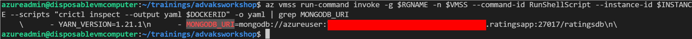

As you can see the secrets are decoded in the container runtime which means most logging systems would log these sensitive data. Hence it is better to store secrets as files since they are not passed as plain text except to the pod and application and access to those can be restricted using RBAC

## Secrets using Key Vault Provider for Secrets Store CSI Driver

In the previous section we stored secrets using a file in a pod and showed why it is the best option. However there are situations where you can't modify the code to get secrets from files and need to use an environmental variable, like in the case of our Fruit Smoothie deployment. 

You saw in the previous section that base64-encoded secrets are not secure at all. For highly secure environments, you will want to use a better secret store. Azure offers an industry-compliant key and secret storage solution called Azure Key Vault. Microsoft maintains the Key Vault implementation of the Secret Store CSI driver, named Azure Key Vault provider for Secrets Store CSI driver. This implementation allows you as a user to access Key Vault secrets from within Kubernetes. It is also integrated with pod identities to restrict access to secrets. 

This CSI driver is now available as managed add-on to AKS currently in preview at the time of writing. Please note that in order for the CSI driver to sync secrets in the Key Vault to secrets in Kubernetes, you need to mount the secret as a Volume in Kubernetes.

We begin by creating a managed identity

### Creating a Managed Identity

It is recommended that you use a managed identity to link your Kubernetes cluster to Key Vault. For this, you can use the AAD pod-managed identity add-on that you set up in the [Azure AD pod-managed identities on AKS](../Security-with-AAD-pod-managed-identities/README.md) section.

> If you are having trouble in this section and you haven't completed the  [Azure AD pod-managed identities on AKS](../Security-with-AAD-pod-managed-identities/README.md) section, you may want to do that first. The instructions to enable pod-managed identities are in the first few steps.

1. Similar to the previous section, type managed identity in the search bar and select **Managed Identities** in the results

2. Click **+ New** button at the top of the resulting page. To organize resources we will create a new resource group for this managed identity called *csi-key-vault*.

3. Select the region you used to create the cluster and name the key-vault *csi-to-key-vault*. Your form should look like this

   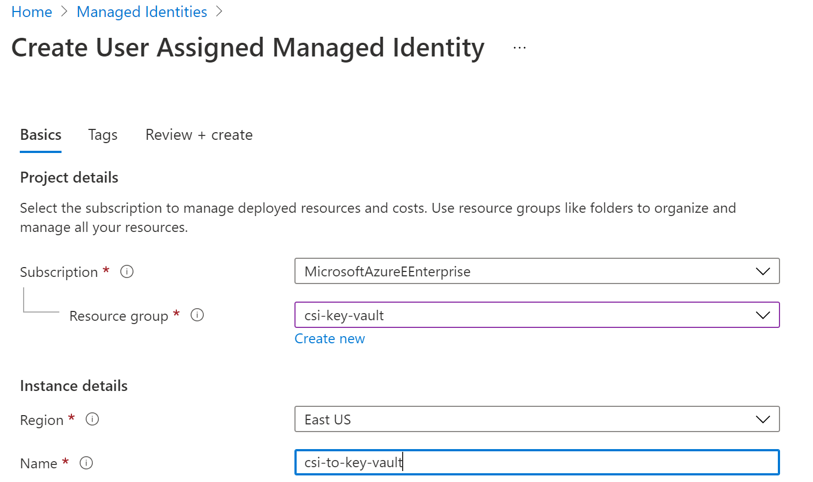

4. Click **Review + create** then click **Create** in the resulting screen

5. Once the resource has been create click **Go to resource** button

6. In the resulting page, click on **Properties** in the left pane and save the *Resource ID* since you will need it later. 

   ```bash
   RESOURCE_ID=<Resource ID>
   ```

   Below is an example of what the *Resource ID* should look like

   ```bash
   RESOURCE_ID=/subscriptions/f37c6be5-84d0-4994-b205-fc8ffb9b5e7e/resourceGroups/csi-key-vault/providers/Microsoft.ManagedIdentity/userAssignedIdentities/csi-to-key-vault
   ```

7. Next we will link the pod-identity with the aks cluster as we did in the [Azure AD pod-managed identities on AKS](../Security-with-AAD-pod-managed-identities/README.md) section. If you haven't enabled pod-identity in your cluster yet, you need to do that by following the instructions in that section, it is part of the first few commands. 

   > You need to enable AKS-managed Azure Active Directory before you enable a pod-managed identity. This topic was covered in the [Security with RBAC](../Security-with-RBAC/README.md) section

   ```bash
   az aks pod-identity add --resource-group $RESOURCE_GROUP \
   --cluster-name $AKS_CLUSTER_NAME --namespace default \
   --name csi-to-key-vault \
   --identity-resource-id $RESOURCE_ID
   ```

   > If you have trouble running that section try getting credentials for your AKS cluster again then rerun the command
   >
   > ```
   > az aks get-credentials -g $RESOURCE_GROUP \
   >  -n $AKS_CLUSTER_NAME --overwrite-existing
   > ```

8. You can verify that the pod-identity has been successfully linked to your cluster

   ```bash
   kubectl get azureidentity
   ```

   The result should look like this

   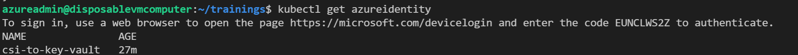

### Creating a Key Vault

1. We begin by typing *key vault* in the search bar in Azure portal and selecting **Key vaults**

2. Click the **+ New** button to start the creation process

3. Provide details required, using the same resource group you created in the previous step. Your form should look like the picture below. Note if you want to purge a soft-deleted keyvault, enter the command below

   ```
   az keyvault purge --name <keyvault name>
   ```

   

   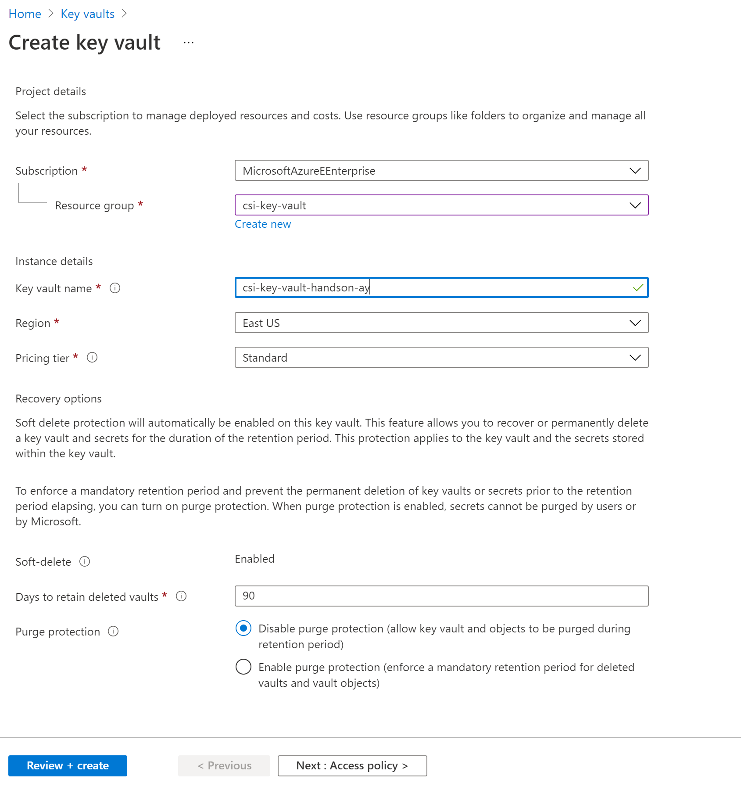

4. Click **Review + create** then click Create** in the resulting page

5. Click on **Go to resource** in the resulting page

6. Click on **Access policies** in the left pane under *Settings*

7. Click on **+ Add Access Policy** link in the middle of the page

   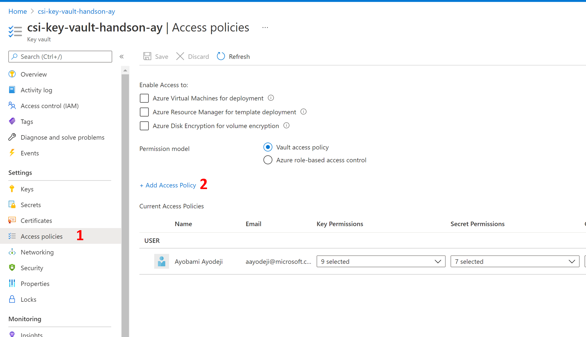

8. Select **Secret Management** for the *Configure from template field*

9. Click on **None selected** in the Select principal field

10. Begin typing the name of the managed identity you just created

11. Select the managed identity

12. Click **Select** at the bottom of the pane

13. Click **Add** 

14. Click on **Save** at the top of the resulting page to complete the process

    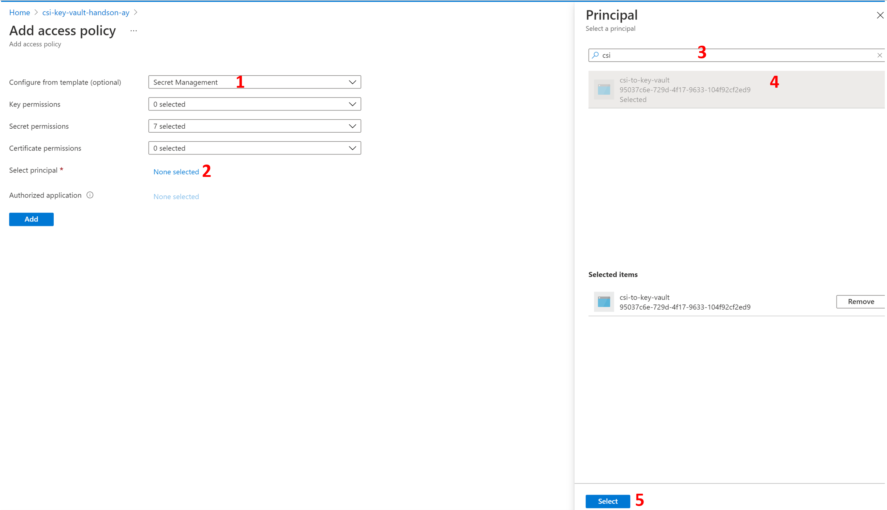

### Create Secret

1. Click on **Secrets** in the left pane and hit the **Generate/Import** button

2. In the secret creation wizard, provide the details about your secret. To make this demonstration easier to follow, use the name k8s-secret-demo. Provide the value of the secret which should be the connection string you used in the previous section 

   ```
   mongodb://azureuser:<password>@ratings-mongodb.ratingsapp:27017/ratingsdb
   ```

   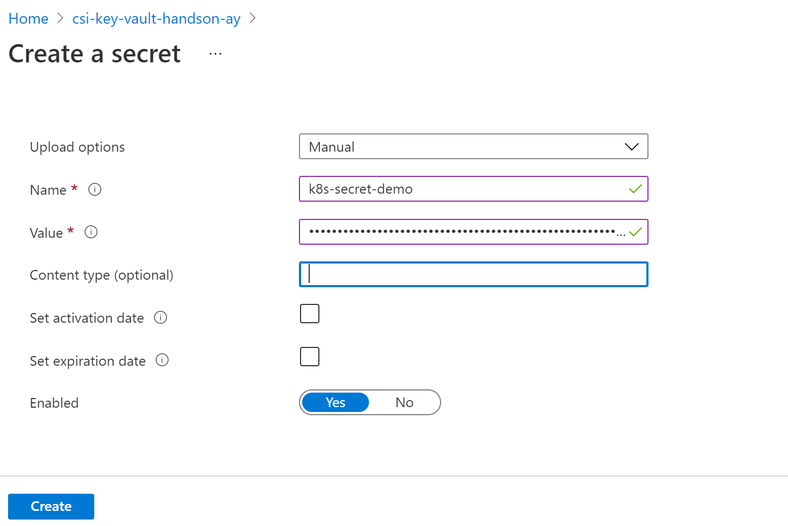

3. Click on the **Create** button at the bottom of the screen to create the secret

Now that you have a secret in Key Vault, you can move ahead and install the actual CSI driver for Key Vault in your cluster.

### Enabling the Provider for Secrets Store CSI Driver

To create an AKS cluster that can use the Secrets Store CSI Driver, you must enable the `AKS-AzureKeyVaultSecretsProvider` feature flag on your subscription. 

> At this point it is assumed you have aks-preview CLI extension already installed

```bash
az feature register --namespace "Microsoft.ContainerService" --name "AKS-AzureKeyVaultSecretsProvider"
```

It takes a few minutes for the status to show *Registered*. Verify the registration status by using the [az feature list](https://docs.microsoft.com/en-us/cli/azure/feature#az_feature_list) command:

```bash
az feature list -o table --query "[?contains(name, 'Microsoft.ContainerService/AKS-AzureKeyVaultSecretsProvider')].{Name:name,State:properties.state}"
```

When ready, refresh the registration of the *Microsoft.ContainerService* resource provider by using the [az provider register](https://docs.microsoft.com/en-us/cli/azure/provider#az_provider_register) command:

```bash
az provider register --namespace Microsoft.ContainerService
```

Next we want to update our cluster with the Secret Store CSI driver support which is in preview at the time of writing this

```bash
az aks enable-addons --addons azure-keyvault-secrets-provider --name $AKS_CLUSTER_NAME --resource-group $RESOURCE_GROUP
```

Verify that the secret driver has been installed properly in your cluster

```bash
kubectl get pods -n kube-system -l 'app in (secrets-store-csi-driver, secrets-store-provider-azure)'
```

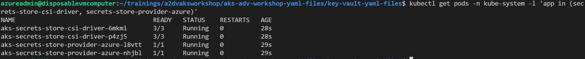

### Using the CSI Driver for Key Vault

#### Mounting a Key Vault secret as a file

We begin by creating a new SecretProviderClass in your cluster

1. Get your AAD tenant ID

   ```bash
   az account show --query tenantId
   ```

2. Next modify the *secretproviderclass-file.yaml* file by providing the tenantId you just obtained and the keyvault name

   ```
   code secretproviderclass-file.yaml
   ```

3. Next we apply the SecretProviderClass in the default namespace since the CSI driver only works in that namespace

   ```bash
   kubectl apply -f secretproviderclassfile.yaml
   ```

   

4. Delete your *ratings-api-deployment* and *ratings-api-deployment-files* pods if you haven't already

   ```bash
   kubectl delete -f ratings-api-deployment.yaml -n ratingsapp
   kubectl delete -f ratings-api-deployment-files.yaml -n ratingsapp
   ```

5. Now modify the manifest file by adding your acr name save it

   ```
   code ratings-api-deployment-kv-files.yaml
   ```

6. Apply the deployment 

   ```bash
   kubectl apply -f  ratings-api-deployment-kv-files.yaml
   ```

   your deployment would never get to a ready state because the mongodb deployment hasnt been added to this namespace here but you can still exec into the container and get the secret as shown below

   


#### Mounting a Key Vault secret as an environment variable

As mentioned at the begining of this section there are times when we cannot modify the code to get secrets from a file. In this case we would need to use it as an environment variable. Please note that in order for the CSI driver to sync secrets in Key Vault to Secrets in Kubernetes, you need to mount the secret as a Volume in Kubernetes; you cannot only rely on the secret syncing. 

1. We begin by deleting our previous deployment

   ```bash
   kubectl delete -f ratings-api-deployment-kv-files.yaml 
   ```

2. Next we create the secret provider class for environment variables. Open the file that contains the code for the deployment as environment variable and modify the tenant id and key vault name, then save it

   ```bash
   code secretproviderclass-env.yaml
   ```

3. Apply the secret provider class for environment variables

   ```bash
   kubectl apply -f secretproviderclass-env.yaml 
   ```

4. Check to see if its been applied and your result should look like the picture below

   ```bash
   kubectl get secretproviderclass
   ```

   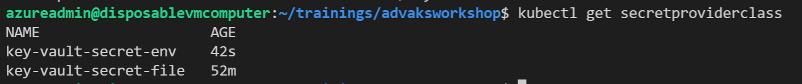

5. Next we deploy our ratings-api again using the file you can find at *ratings-api-deployment-kv-env.yaml*

   ```bash
   kubectl apply -f ratings-api-deployment-kv-env.yaml
   ```

6. Check to see if your pod has been deployed

   ```bash
   kubectl get pods
   ```

7. Exec into your pod to see if you can access the environment variable

   ```bash
   kubectl exec -it ratings-api-kv-env-5995f7df9f-6rnzt -- sh
   ```

8. Enter the code below to see your secret. You will see the secret you stored in your key vault. This is ready for your app to use. Type exit to exit the pod

   ```
   echo $MONGODB_URI
   ```

   

9. Now you can check to see it listed as one of the secrets

   ```bash
   kubectl get secrets
   ```

10. You can see that the secret gets automatically deleted when there are no pods using the secret

    ```bash
    kubectl delete -f ratings-api-deployment-kv-env.yaml
    ```

    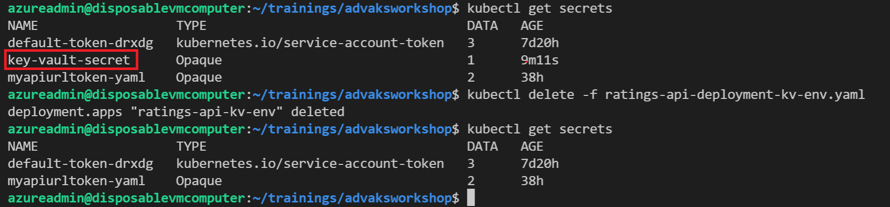

### Bringing it all together

Now that we have our secret securely stored in keyvault and syncing with our Kubernetes secrets. lets deploy the rest of the microservice to ensure everything works as expected. We begin by increasing the number of nodes in our cluster to ensure we have enough resources

```bash
az aks scale --resource-group $RESOURCE_GROUP \
	--name $AKS_CLUSTER_NAME \
	--node-count 4 \
	--nodepool-name <nodepool name>
```

1. We create the mongodb pods using helm like we did during the workshop but this time in the default namespace

   ```bash
   helm install ratings bitnami/mongodb \
       --set auth.username=<username>,auth.password=<password>,auth.database=ratingsdb
   ```

2. Wait for the pods to get to a ready state

   ```bash
   kubectl get pods -w
   ```

3. Next we create the ratings-api and ratings-web pods

   ```bash
   kubectl apply -f ratings-api-deployment-kv-env.yaml
   kubectl apply -f ratings-web-deployment.yaml 
   ```

4. Expose these pods using services. This time we will use a Load Balancer service for the web deployment so that we don't need to configure an ingress controller

   ```bash
   kubectl apply -f ratings-web-service.yaml
   ratings-api-service.yaml
   ```

5. Finally we view the services so that we can get the public ip of the web service

   ```
   kubectl get services
   ```

6. Copy the external IP from the result and paste it in your browser and you should have your fruit smoothie app running

   

### Cleanup

We have come to the end of this workshop. Please cleanup your resources by executing the following.

```bash
az group delete -n csi-key-vault --yes
az group delete -n $RESOURCE_GROUP --yes
```
Go to your Azure portal, search for resource groups choose **Resource groups**. Find the resource group that has a name that starts with *MC* and has a name similar to your AKS cluster resource group you used in this workshop. Select it, click **Delete resource group** at the top of the next page, copy and paste the name of the resource group in the pane that opens up and paste it in the space provided. Click **Delete** at the bottom of the screen.

### Next steps

Check out the free book this workshop is based on here: [Hands-on Kubernetes on Azure](https://aka.ms/handson-aks-book)
For more advanced lessons on securing AKS clusters, check out the [AKS Secure Baseline](https://github.com/mspnp/aks-secure-baseline)