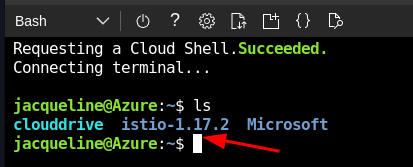

# Integrate the Istio Service Mesh with AKS

This training module provides step-by-step guidance for integrating the *Istio* Service Mesh into an AKS cluster. You'll also find steps for leveraging Istio to provide targeted canary releases for rolling out application updates.

## Introduction

A  [service mesh](https://docs.microsoft.com/dotnet/architecture/cloud-native/resilient-communications#service-mesh) is a decentralized application networking layer, highly optimized for modern workloads, such as microservice applications. The mesh provides built-in capabilities that handle key infrastructure concerns:

- Service communication and routing
- Service identity and security
- Policy enforcement
- Observability

A service mesh decouples infrastructure capabilities from the application. It moves infrastructure plumbing from the application services to a *proxy* container that is injected alongside each of the application service containers. This side-by-side architecture is referred to as a [sidecar](https://docs.microsoft.com/azure/architecture/patterns/sidecar). Although a separate component, a sidecar proxy is *loosely coupled* (or linked) to its corresponding service - the sidecar is created with the application service and shares its lifecycle.

Figure 1 shows an example of a service mesh architecture.


**Figure 1**. Service mesh with sidecars

In the previous figure, note how each microservice has a corresponding sidecar proxy to handle its infrastructure concerns. When deployed to Kubernetes, an application service and sidecar proxy reside together in a Kubernetes pod.

Istio is a full featured, customizable, and extensible service mesh. It's arguably the most popular  mesh. It's open source and specifically designed to secure and manage traffic between microservices running in different containers.

> This lab module builds upon the completion of the [Azure Kubernetes Workshop](https://docs.microsoft.com/learn/modules/aks-workshop/?WT.mc_id=api_CatalogApi) found in the Microsoft Learn training library. In that workshop, you built an AKS cluster hosting the *Fruit Smoothies* line-of-business application. This module will integrate the Istio Service Mesh into the application.  

## Pre-requisites

The following steps are required to successfully complete this module:

- A *Fruit Smoothies* AKS cluster built from the [Azure Kubernetes Workshop](https://docs.microsoft.com/learn/modules/aks-workshop/?WT.mc_id=api_CatalogApi).

- At least two node instances, if the cluster is running on Standard_DS2_v2 virtual machines (the default VM size)

- Azure Subscription (commercial)

## Tutorial: Install Isito

*(15 minutes)*

In this tutorial, you'll install the Istio Service Mesh into your AKS cluster.

The installation involves several steps. The instructions presented are a subset of the  [Install and use Istio in Azure Kubernetes Service (AKS)](https://docs.microsoft.com/azure/aks/servicemesh-istio-install?pivots=client-operating-system-windows) taken from [Microsoft Docs](https://docs.microsoft.com/).

### Install the Istio client binary

You will start by installing the *Istioctl CLI* into your client. Similar to the Kubernetes, *kubectl* CLI, istioctl may be used to install and manage Istio within an AKS cluster.

To complete this lab, you'll use the Azure Cloud Shell. It's an interactive, authenticated, browser-accessible shell for managing Azure resources, including AKS. Conveniently, it's built into the Azure portal and is preloaded with many of the Azure libraries you will need. It provides both a Bash and PowerShell CLI experience.

Logon to the [Azure Portal](https://ms.portal.azure.com/). Once loaded, open up an Azure Cloud Shell session by clicking on the Cloud Shell icon in the top navigation menu as shown in figure 2.


**Figure 2**. Azure Cloud Shell launch icon

Next, select the **Bash** CLI from the drop-down list box in the upper left-hand corner as shown below in Figure 3.


**Figure 3**. Azure Cloud Shell CLI experience

You'll start by installing the Istioctl client binary.

The binary runs on the client machine enabling you to install and manage Istio in an AKS cluster.

The following commands will download and install the Istioctl client binary into your CloudShell instance. It'll be available immediately (in the current shell) and permanently (across shell restarts) via your PATH.

Use the following command to load identity credentials for your AKS cluster. You will need to provide your resource group and cluster name.

```Bash
az aks get-credentials --resource-group RG-NAME --name CLUSTERNAME
```

From the CloudShell CLI, use the following commands to download Istio.

```Bash
curl -L https://istio.io/downloadIstio | sh -
```

Next, open the folder in which Istio was downloaded and note the version number that is appended to the folder name: istio-X.X.X

Figure 4 shows the Istio version number of the downloaded package.



**Figure 4**. The Istio version number

Next, make the following changes:

```bash
# Change to the istio folder 
cd istio-X.X.X # Replace X.X.X. with the Istio version number
export PATH=$PWD/bin:$PATH
```

Next, you will use the Istioctl CLI to install Istio into your AKS cluster:

``` bash
istioctl install
```

At this point, you've installed the Istio into your cluster. Use the following command to validate the Istio deployment.

```bash
kubectl get all -n istio-system
```

You should see the following components:

```Console
NAME                                        READY   STATUS    RESTARTS   AGE
pod/istio-ingressgateway-85c449d886-z98sm   1/1     Running   0          4h15m
pod/istiod-8495b6467-l2mtn                  1/1     Running   0          4h15m

NAME                           TYPE           CLUSTER-IP     EXTERNAL-IP   PORT(S)                                                                      AGE
service/istio-ingressgateway   LoadBalancer   10.0.111.248   20.81.1.193   15021:30278/TCP,80:30889/TCP,443:32178/TCP,15012:30786/TCP,15443:30325/TCP   4h15m
service/istiod                 ClusterIP      10.0.164.124   <none>        15010/TCP,15012/TCP,443/TCP,15014/TCP                                        4h15m

NAME                                   READY   UP-TO-DATE   AVAILABLE   AGE
deployment.apps/istio-ingressgateway   1/1     1            1           4h15m
deployment.apps/istiod                 1/1     1            1           4h15m

NAME                                              DESIRED   CURRENT   READY   AGE
replicaset.apps/istio-ingressgateway-85c449d886   1         1         1       4h15m
replicaset.apps/istiod-8495b6467                  1         1         1       4h15m

NAME                                                       REFERENCE                         TARGETS   MINPODS   MAXPODS   REPLICAS   AGE
horizontalpodautoscaler.autoscaling/istio-ingressgateway   Deployment/istio-ingressgateway   3%/80%    1         5         1          4h15m
horizontalpodautoscaler.autoscaling/istiod                 Deployment/istiod                 0%/80%    1         5         1          4h15m
```

### Additional Configuration

There's some additional configuration that needs to happen.

Run the following command to take a look at the current state of istio for the Fruit Smoothies application:

```bash
 istioctl analyze -n ratingsapp
```

> Note: The *ratingsapp* namespace is the location in which you previously deployed the fruit smoothies application.

You will see some error and warning messages:

```bash
Warn [IST0102] (Namespace ratingsapp) The namespace is not enabled for Istio injection. Run 'kubectl label namespace ratingsapp istio-injection=enabled' to enable it, or 'kubectl label namespace ratingsapp istio-injection=disabled' to explicitly mark it as not needing injection
Info [IST0118] (Service ratings-api.ratingsapp) Port name  (port: 80, targetPort: 3000) doesn't follow the naming convention of Istio port.
Info [IST0118] (Service ratings-web.ratingsapp) Port name  (port: 80, targetPort: 8080) doesn't follow the naming convention of Istio port.
Error: Analyzers found issues when analyzing namespace: ratingsapp.
```

To resolve these messages, you'll need to add an Istio *automated-injection* label to the namespace in which the Fruit Smoothies application is running. By doing so, Istio will inject an Istio proxy sidecar to all pods deployed in this namespace. The following command adds that label to Fruit Smoothies application namespace:

```bash
kubectl label namespace ratingsapp istio-injection=enabled
```

Once complete, you'll need to update both the ratings-api-service.yaml and ratings-web-service.yaml files as shown here:

> You'll add the line **name: tcp** to the bottom of the ports section in each of the yaml files. The line must be lowercase and pay close attention to spacing.

The resulting YAML file should look like the following:

```yaml
    ports:
    - protocol: TCP
      port: 80
      targetPort: 8080
      name: tcp  # <-- add this line and make sure spacing correct and all lowercase.
```

Now, you need to redeploy both services:

```bash
kubectl apply --namespace ratingsapp -f ratings-api-service.yaml

kubectl apply --namespace ratingsapp -f ratings-web-service.yaml
```

Run the Istioctl analyze command again to verify everything is setup correctly.

```bash
 istioctl analyze -n ratingsapp
```

Notice the output. Everything is set up correctly, but there are still warnings that the istio side-car proxies have not been setup.

```bash
Warn [IST0103] (Pod ratings-api-84d457f946-lvd2h.ratingsapp) The pod is missing the Istio proxy. This can often be resolved by restarting or redeploying the workload.
Warn [IST0103] (Pod ratings-mongodb-54bd7b4784-42xhb.ratingsapp) The pod is missing the Istio proxy. This can often be resolved by restarting or redeploying the workload.
Warn [IST0103] (Pod ratings-web-77876c96d8-kbglz.ratingsapp) The pod is missing the Istio proxy. This can often be resolved by restarting or redeploying the workload.
Error: Analyzers found issues when analyzing namespace: ratingsapp.
```

Since the deployment was done before Istio was installed and configured, you'll need to redeploy the pods.  One approach would be to delete the pods. The Kubernetes deployment will then automatically recreate them.

First, use the following command to get the name of pods to delete:

```bash
kubectl get pods -n ratingsapp
```

You should see three pods:

```bash
NAME                               READY   STATUS    RESTARTS   AGE
ratings-api-84d457f946-lvd2h       1/1     Running   0          154m
ratings-mongodb-54bd7b4784-42xhb   1/1     Running   0          5h48m
ratings-web-77876c96d8-kbglz       1/1     Running   0          151m
```

Now delete the three pods. Run the following command three times replacing the names of pods with those from the above command.

```bash
kubectl delete -n ratingsapp pod <your POD-NAMEs>
```

Once complete, run the following command to view the newly-create pods:

```bash
kubectl get pods -n ratingsapp
```

You should see three pods. Notice, however, that two containers (the application service and Istio sidecar) are now running in each pod (the **2/2** number under the **ready** the header):

```bash
NAME                               READY   STATUS    RESTARTS   AGE
ratings-api-84d457f946-gnv2p       2/2     Running   1          118s
ratings-mongodb-54bd7b4784-t77l9   2/2     Running   0          86s
ratings-web-77876c96d8-nbw9p       2/2     Running   0          57s
```

Run the following the command to inspect one the pods. Replace the **POD-NAME** with the full name of one the pods for the previous command.

```bash
kubectl describe -n ratingsapp pod <POD-NAME>
```

You will see a large amount of metadata information about this pod.  Find the **Containers section**. There, you'll see a container named 'istio-proxy' and its related information:

```bash
  istio-proxy:
    Container ID:  containerd://f6192e62d3d8e47caf5cc8675b96cf81a2b9a900c2c492299b55e26404924039
    Image:         docker.io/istio/proxyv2:1.9.5
    Image ID:      docker.io/istio/proxyv2@sha256:01fc76f6dd3665ff1dd4aa9e309e4b02380fa266763e172ca07c766e8d2fe2d7
    Port:          15090/TCP
    Host Port:     0/TCP
    Args:
      proxy
      sidecar
      --domain
      $(POD_NAMESPACE).svc.cluster.local
      --serviceCluster
      ratings-web.$(POD_NAMESPACE)
      --proxyLogLevel=warning
      --proxyComponentLogLevel=misc:error
      --log_output_level=default:info
      --concurrency
      2
    State:          Running
      Started:      Wed, 19 May 2021 02:02:19 +0000
    Ready:          True
```

Congratulations!  You have successfully installed Istio and configured the Fruit Smoothies app to use it.

## Tutorial: Canary Releases with Isito

*(20 minutes)*

In this next tutorial, you'll use the Istio service mesh to implement a Canary release in your AKS cluster.

A canary release is a software deployment technique that reduces the risk of introducing a new software version into production by slowly rolling out the change to a small subset of users before rolling it out to the entire infrastructure and making it available to everybody.

Figure 5 shows a canary release.


**Figure 5**. Canary release

Note in the above figure how the new version of the application is rendered to only 5% of the users. You'll increase that number as you gain experience and confidence with the new version. If something were to go wrong, you could  route all users back to the old version.

### Deploy an application and configure the Istio Gateway

To start, you'll deploy a different application, BookInfo, to implement canary releases. The application ships as a sample with the Istio installation.

To start, you'll deploy an application entitled *BookInfo* to the existing cluster.

First, create a new Kubernetes namespace for the BookInfo app with the following command:

```bash
kubectl create namespace bookinfo
```

This command creates the *bookinfo* namespace in your Kubernetes cluster. To confirm, type the following command to show all namespaces from your cluster:

```bash
kubectl get namespace
```

You should see *bookinfo* in the list.

Next, enable the bookinfo namespace to use the Istio Service Mesh. Every time a bookinfo pod is created, you'll want an Istio sidecar container injected into it. The following command enables an Istio feature called *automatic sidecar injection*.

```bash
kubectl label namespace bookinfo istio-injection=enabled
```

The command adds the label *istio-injection=enabled* to the bookinfo namespace. Upon seeing the label, Istio will automatically inject a sidecar into any pod you instantiate in the bookinfo namespace.

Type the following command to see the newly created label:

```bash
kubectl get namespace --show-labels
```

You should see the newly created label for the bookinfo namespace:

```console
NAME              STATUS   AGE     LABELS
bookinfo          Active   6m31s   istio-injection=enabled
cert-manager      Active   80d     <none>
clusterinfo       Active   37d     app.kubernetes.io/managed-by=Helm
default           Active   90d     <none>
ingress           Active   80d     <none>
istio-operator    Active   11d     istio-injection=disabled,istio-operator-managed=Reconcile,istio.io/rev=default
istio-system      Active   11d     <none>
kube-node-lease   Active   90d     <none>
kube-public       Active   90d     <none>
kube-system       Active   90d     addonmanager.kubernetes.io/mode=Reconcile,control-plane=true,kubernetes.io/cluster-service=true
ratings-app       Active   90d     istio-injection=enabled
```

Note the *istio-injection=enabled* label in the bookinfo namespace.

Clone the _book info_ sample application.

```bash
# Clone the istio repo, which includes the sample application
git clone https://github.com/istio/istio.git

# Naviagate into the istio folder
cd istio
```

Next, deploy the BookInfo application.

> Remember to add the *--namespace bookinfo* to end of each command!

```bash
kubectl apply -f samples/bookinfo/platform/kube/bookinfo.yaml --namespace bookinfo
```

The command deploys the BookInfo application to the bookinfo namespace. Confirm that the bookinfo services and pods are correctly defined and running:

```bash
kubectl get services,pods --namespace bookinfo 
```

You should see the following services and pods:

```console
NAME          TYPE        CLUSTER-IP   EXTERNAL-IP   PORT(S)    AGE
details       ClusterIP   10.0.0.31    <none>        9080/TCP   6m
productpage   ClusterIP   10.0.0.120   <none>        9080/TCP   6m
ratings       ClusterIP   10.0.0.15    <none>        9080/TCP   6m
reviews       ClusterIP   10.0.0.170   <none>        9080/TCP   6m

NAME                             READY     STATUS    RESTARTS   AGE
details-v1-1520924117-48z17      2/2       Running   0          6m
productpage-v1-560495357-jk1lz   2/2       Running   0          6m
ratings-v1-734492171-rnr5l       2/2       Running   0          6m
reviews-v1-874083890-f0qf0       2/2       Running   0          6m
reviews-v2-1343845940-b34q5      2/2       Running   0          6m
reviews-v3-1813607990-8ch52      2/2       Running   0          6m
```

Next, confirm the Bookinfo application is running by sending a request to it using a curl command.

```bash
kubectl exec "$(kubectl get pods -l app=ratings --namespace  bookinfo -o jsonpath='{.items[0].metadata.name}')" -c ratings --namespace bookinfo -- curl -sS productpage:9080/productpage | grep -o "<title>.*</title>"
```

You should see the following information returned:

```console
<title>Simple Bookstore App</title>
```

Now that BookInfo is up and running, you need to make it accessible from outside of your Kubernetes cluster, e.g., from a browser. An Istio Gateway is used for this purpose.

The following command deploys the Istio ingress gateway for the application:

> Remember to add the *--namespace bookinfo* to end of the command!

```bash
kubectl apply -f samples/bookinfo/networking/bookinfo-gateway.yaml --namespace bookinfo
```

Once complete, confirm that the gateway has been created:

```bash
kubectl get gateway --namespace bookinfo
```

You see the following response:

```console
NAME               AGE
bookinfo-gateway   11s
```

Next, you'll set environment variables for the gateway host and port. The first command creates an environment variable entitled INGRESS_HOST with the IP address of the load balancer:

```bash
export INGRESS_HOST=$(kubectl -n istio-system get service istio-ingressgateway -o jsonpath='{.status.loadBalancer.ingress[0].ip}')
```

The next command creates an environment variable entitled INGRESS_PORT that contains the port:

```bash
export INGRESS_PORT=$(kubectl -n istio-system get service istio-ingressgateway -o jsonpath='{.spec.ports[?(@.name=="http2")].port}')
```

Finally, create a third environment variable entitled GATEWAY_URL:

```bash
export GATEWAY_URL=$INGRESS_HOST:$INGRESS_PORT
```

The $GATEWAY_URL is the external IP address of the Istio gateway. It's the ingress gateway for the BookInfo application.

Execute the following curl command to confirm the application is available from outside the cluster:

```bash
curl -s "http://${GATEWAY_URL}/productpage" | grep -o "<title>.*</title>"
```

If all goes right, you will see:

```console
<title>Simple Bookstore App</title>
```

Input the following command to return the GATEWAY_URL for your instance:

```bash
echo $GATEWAY_URL
```

Finally, copy and paste the $GATEWAY_URL value into Notepad on your computer. You'll need it shortly.

## Traffic Routing with Istio

The traffic routing features of Istio enables you to specify routing rules that control traffic flow between frontend APIs and backend services. Included are service-level properties that support A/B testing, canary rollouts, and staged rollouts with percentage-based traffic splits. It also provides built-in failure recovery features to make your application more robust against failures of dependent services or the network.

Two resources for traffic routing are Istio *destination rules* and *virtual services*.
## Apply destination rules

Before you can use Istio to control routing to a specific version of the BookInfo application, you'll need to define the available versions, called subsets, using Istio destination rules.

Destination rules specify a subset of services to be invoked by a request. Often, subsets are grouped based upon a given version of the services.

The next command will apply a default destination rule to the BookInfo service:

```bash
kubectl apply -f samples/bookinfo/networking/destination-rule-all.yaml --namespace bookinfo
```

Allow a few seconds for the destination rules to propagate.

Examine the destination rules with the following command:

```bash
kubectl get destinationrules -o yaml --namespace bookinfo
```

## Apply virtual services

In this task, you'll learn how to dynamically route requests to different versions of your application.

You'll combine Istio *virtual services* with Istio *destination rules*. Virtual services contain the routing rules that let Istio route each incoming request to a specific destination in the Istio mesh. They decouple where clients send requests from the workloads that actually implement them.

A use case might be a requirement to send traffic to different versions of a service, specified as *service subsets*. Clients send requests to the virtual service host as if it was a single entity. Istio routes the traffic to different application versions as configured in the virtual service rules. For example, 20% of requests route to the new version and the remainder to the current version. Or, calls from users in a specific group, maybe, an early adopter group, route to version 2. As mentioned previously, these features enable canary rollouts, where you gradually increase the percentage of traffic that’s sent to a new service version. In these scenarios, traffic routing is *separate* from the deployed instances. The number of instances implementing the new service version can scale up and down based on traffic load without being coupled to traffic routing component. By contrast, container orchestration platforms like Kubernetes only support traffic distribution based on instance scaling, which can quickly become complex.

### Routing based on percentage-based traffic splits

The BookInfo sample application is composed from four separate microservices, each with multiple versions. The review microservice currently has three different versions which are running concurrently. Open a browser and type in the URL for the BookIinfo product page:

```http
http://<your GATEWAY_URL>/productpage
```

Continue to refresh the browser with the &lt;F5&gt; key. Note each time that the book review sometimes contains star ratings images and other times not. Sometimes the stars are colored red, and other times, black. Without an explicitly declared default service version, Istio routes requests to all available versions in a round robin fashion. To manage routing, you'll apply rules that route traffic to a specific instance of the microservice. Keep the browser open.

To route to one version only, you'll apply a virtual service that sets the default version for a microservice. In this example, you'll apply a virtual services that routes all traffic to v1 of each microservice:

```bash
kubectl apply -f samples/bookinfo/networking/virtual-service-all-v1.yaml --namespace bookinfo
```

The configuration propagation is eventually consistent, so wait a few seconds for the virtual service to take effect.

Once applied, display the newly-defined routes with the following command:

```bash
kubectl get virtualservices -o yaml --namespace bookinfo
```

Go back to your open browser and type the following URL:

```http
http://<your GATEWAY_URL>/productpage
```

As you refresh your browser, note how none of the reviews contain stars. You have configured Istio to route all traffic to v1 version of the BookInfo application. Version 1 of the review microservice doesn't render star images.

How would you approach evaluating multiple application versions at once?

You'll next deploy a virtual service implements just that. Using a canary release strategy, it routes 33% of the incoming traffic to version 1, 33% to version 2, and %34 percent to version 3.

To do so, you'll need to edit the yaml file to adjust the routing of the VirtualService

 ```bash
 code samples/bookinfo/networking/virtual-service-reviews-90-10.yaml
 ```

This will open this file in Visual Studio code. Update the http section to look like the following:

 ```yaml
   http:
  - route:
    - destination:
        host: reviews
        subset: v1
      weight: 33
    - destination:
        host: reviews
        subset: v2
      weight: 33
    - destination:
        host: reviews
        subset: v3
      weight: 34
 ```

Save and close file, and then update the Virtual Service with the following command:

```bash
kubectl apply -f samples/bookinfo/networking/virtual-service-reviews-90-10.yaml --namespace bookinfo
```

Go back to your open browser. As you refresh it, note how some reviews contain no stars, some contain black stars, and some red stars. You are now routing requests across all three services with a equal traffic split distribution. 

After running the canary release with three versions, you might decide that version 3, not 2, is your target version. You'll now modify the canary release to distribute traffic equally between the current version and version 3. Deploy the following virtual service:

```bash
kubectl apply -f samples/bookinfo/networking/virtual-service-reviews-50-v3.yaml --namespace bookinfo
```

Go back to your open browser. As you refresh it, note how the review alternates between version 1 which contains no stars and version 3 which contains red stars. You have implemented a 50% traffic split between version 1 and 3.

At some point, you're confident that version 3 is ready of the masses. Deploy a virtual service that routes all traffic to version 3:

```bash
kubectl apply -f samples/bookinfo/networking/virtual-service-reviews-v3.yaml --namespace bookinfo
```

Back in your open browser, all reviews will render red stars.

Congratulations, you have successfully accomplished the first part of this task: Implement a canary release using the Istio service mesh.

## Route based on user identity

You might also have a requirement for canary deployments that route traffic to certain groups, such as *early adopters*, or even specific individuals. 

Next, you'll change the route configuration so that all traffic from a specific user is routed to a specific service version. In this case, all traffic from a user named Jason will be routed to version 2 of the application. Version 2 includes the star ratings feature.

```bash
kubectl apply -f samples/bookinfo/networking/virtual-service-reviews-jason-v2-v3.yaml --namespace bookinfo
```

Go back to your open browser, as you refresh it, note how the review section does not render star images.

On the /productpage of the BookInfo app, log in as user jason.

> Note: Both the login and password values: jason

Refresh the browser. What do you see? The star ratings appear next to each review.

Log in as another user (pick any name you wish).

Refresh the browser. Now the stars are gone. This is because only traffic for the user is routed to newer version.

Congratulations. You have successfully configured Istio to route traffic based on user identity.

## Other Service Meshes
### Linkerd

[Linkerd](https://docs.microsoft.com/azure/aks/servicemesh-linkerd-about) is an easy to use and lightweight service mesh. It provides a data plane that is composed of ultralight Linkerd specialized proxy sidecars. These intelligent proxies control all network traffic in and out of your meshed apps and workloads. The proxies also expose metrics via [Prometheus](https://prometheus.io/) metrics endpoints.
Update the ratings app namespace to inject istio side-cars

### Microsoft's Open Service Mesh

Microsoft's [Open Service Mesh (OSM)](https://docs.microsoft.com/azure/aks/servicemesh-osm-about?pivots=client-operating-system-linux) is a lightweight, extensible, Cloud Native service mesh that allows users to uniformly manage, secure, and get out-of-the-box observability features for highly dynamic microservice environments. It's designed as a "lighter-weight" version of Istio.

Similar to Istio, OSM runs an Envoy-based control plane on Kubernetes, can be configured with SMI APIs, and works by injecting an Envoy proxy as a sidecar container next to each instance of your application. The Envoy proxy executes rules specified in access control policies, implements routing configuration, and captures metrics. The control plane continually configures proxies to ensure policies and routing rules are up to date and ensures proxies are healthy.

Currently, Open Service Mesh is in preview mode.

## References

The resources below provide additional information about service meshes.

- [About service meshes](https://docs.microsoft.com/azure/aks/servicemesh-about)
- [Istio Architecture](https://istio.io/latest/docs/ops/deployment/architecture/)
- [Install and use Istio in Azure Kubernetes Service](https://docs.microsoft.com/en-us/azure/aks/servicemesh-istio-install?pivots=client-operating-system-linux)
- [Istio Architecture](https://istio.io/latest/docs/ops/deployment/architecture/)
- [What's a service mesh?](https://www.redhat.com/en/topics/microservices/what-is-a-service-mesh)
- [Canary releases](https://martinfowler.com/bliki/CanaryRelease.html#:~:text=Canary%20release%20is%20a%20technique,making%20it%20available%20to%20everybody)
