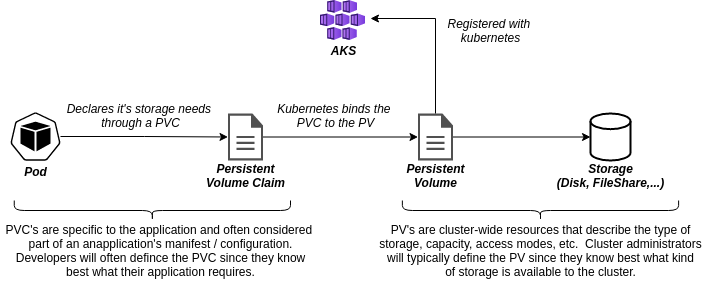

# Persistent Volumes, Claims, and Storage Classes

## Introduction

Applications/workloads running in Kubernetes often times have requirements to store data that the application depends on.  For example, if you were to run a containerized version of WordPress or Drupal on Kubernetes, the static content (ie: blogs, pictures, etc.) would be stored on a local file system.  To support applications with such requirements in Kubernetes, we rely on Kubernetes resources, such as [persistent volumes (PV)](https://kubernetes.io/docs/concepts/storage/persistent-volumes/), [persistent volune claims (PVC)](https://kubernetes.io/docs/concepts/storage/persistent-volumes/#persistentvolumeclaims), and [storage classes (SC)](https://kubernetes.io/docs/concepts/storage/storage-classes/).

The graphic below illustrates the relationship between a pod, PVC, PV, and Kubernetes.





This module will guide you through the tutorials below to give you hands-on experience configuring and using persistent volumes/claims and storage classes.  You will start by examining the simplest storage, which is ephemeral _pod_ storage.  Next, you will got through some laborious exercises to statically configure _node_ storage and then _shared_ storage.  The reason you will do these laborious and error-proned exercises is so that you can understand and appreciate what is happening when you _dyanamically_ request storage for your applications, which is the recommended pattern for configuring storage on your cluster.  Finally, the last tutorial will guide you through the steps to expand a volume to allocate more storage for your applications.

- [Pod storage](#tutorial-pod-storage)
- [Node storage (static)](#tutorial-node-storage-static)
- [Shared storage (static)](#tutorial-shared-storage-static)
- [Shared storage (static) with PV/PVC](#tutorial-shared-storage-with-pvpvc-static)
- [Shared storage (dynamic)](#tutorial-shared-storage-dynamic) - Recommended 
- [Volume expansion](#tutorial-volume-expansion)

## Pre-requisites
 
The following are required to successfully complete this module.

- Azure Subscription (commercial or government)
- Bash shell - Ubuntu, Mac, Windows (WSL), Azure Portal (cloud-shell)
- An AKS instance 

## Tutorial: Pod storage
_(10 minutes)_

In this tutorial, you will explore volume storage that is local to a pod.  This kind of volume storage is created when a pod is scheduled to a node and is removed when a pod is removed from the node (for any reason).  If a pod is re-created, even on the same node, any data that was written to the volume previously is lost.  In Kubernetes, this kind of storage/persistence is known as the [`emptyDir` volume](https://kubernetes.io/docs/concepts/storage/volumes/#emptydir).

This tutorial will use an nginx container running on your cluster to demonstrate the learning objectives.  Before proceeding, review [`01-pod-storage.yaml`](./01-pod-storage.yaml) to familiarize yourself with what it does.

### Step-by-step instructions

Execute the commands below from a bash command shell.  Alternatively, you can use the [Azure Cloud Shell](https://docs.microsoft.com/en-us/azure/cloud-shell/overview) in the Azure portal.

```bash
# Make sure you're in the storage folder.
cd ./storage

# Apply deployment to the cluster
kubectl apply -f ./01-pod-storage.yaml

# List the pod that was created
kubectl get pods

# Setup port forwarding so you can browse to the running container.
# Replace '[pod-name]' with the name of your pod.
kubectl port-forward [pod-name] 8080:80

# Open browser to localhost:8080.
# Observe that the response is the standard 'Welcome to nginx!' response.

# Press Ctrl-c to terminate the port forwarding.

# Make a change in the container's file system
# Specifically, change the contents of the 'index.html' file
# that nginx returns when you browse to it.
kubectl exec --stdin --tty [pod-name] -- /bin/bash

# Now you are in the pod's file system.  Perform the following commands:

#   cd /usr/share/nginx/html
#   cat index.html    // Notice it's the HTML you observered previously.
#   echo "Hi there!" > index.html
#   cat index.html    // Notice the new contents of index.html.
#   exit

# Setup port forwarding again
kubectl port-forward [pod-name] 8080:80

# Open browser to localhost:8080.
# Observe the response contains the new text that was added.

# Press Ctrl-c to terminate the port forwarding.

# Delete the pod - kubernetes will re-create it
kubectl delete pod [pod-name]

# List the new pod that was created
kubectl get pods

# Setup port forwarding to the new pod
kubectl port-forward [pod-name] 8080:80

# Open browser to localhost:8080

# Observe the response is the original nginx response, meaning, our change to
# ths filesystem was *not* persisted when the pod was deleted and then re-created.

# Press Ctrl-c to terminate the port forwarding.

# Delete the deployment
kubectl delete -f ./01-pod-storage.yaml
```

### Summary

In this tutorial, you observed that, by default, the lifecyle of storage used by a pod follows the lifecycle of the pod.  If a pod is deleted and re-created for any reason, any data written to the filesystem in the pod is lost.

You also observed that you didn't have to add any volume configuration to the configuration for this to work.  However, if you wanted to be explicit about it, you could add the `spec.volumes` and `spec.containers.volumeMounts` as shown in `01-pod-storage-explicit.yaml`.  It would be a good idea to review [`01-pod-storage-explicit.yaml`](./01-pod-storage-explicit.yaml) and understand the configuration because it will be used in subsequent tutorials.

## Tutorial: Node Storage (static)
_(15 minutes)_

In this tutorial, you will explore volume storage that is attached to a node.  In Azure, this kind of volume storage is attached to a node as an [Azure data disk](https://azure.microsoft.com/en-us/services/storage/disks/).  Because the volume is attached to the node, multiple pods running on a node are able to persist and share data.  This also allows a pod to retrieve that data if the pod gets deleted and re-created on the node.

This tutorial uses the same nginx container you used previously to demonstrate the learning objectives.  Before proceeding, review [`02-node-storage.yaml`](./02-node-storage.yaml) to familiarize yourself with what it does.  In particular, notice the following changes:

- A public load balancer is added as a [service](https://kubernetes.io/docs/concepts/services-networking/service/) resource.  This is added simply to make it easier for you to interact with the nginx container(s) withouth having to do port-forwarding like you did in the previous tutorial.
- An `azureDisk` volume called "html" was added to `spec.volumes`.
  - Notice the `diskURI` property. You will replace this value with the disk resource ID of a disk you will create shortly.
- The "html" volume is mounted in the container via the configuration at `spec.containers.volumeMounts`.

### Preliminary cluster coniguration

Before you apply this deployment to your cluster, there are a few items that need to be done first as described here:

- Disable the cluster auto-scaler.  Doing this will allow you to manually scale the nodes.  At the end of the module, this will be re-enabled so your cluster is put back to it's original state.
- Scale the cluster to two (2) nodes.
- Create a disk that can be attached to a node in the cluster.

```bash
# Sign-in to your subscription if you're not already signed-in.
az login

# Define some environment variables
AKS_WORKSHOP_RG="[your aks-workhsop resource group name]"
AKS_WORKSHOP_CLUSTER="[your aks-workhsop cluster name]"
AKS_WORKSHOP_NODE_RG=$(az aks show --resource-group $AKS_WORKSHOP_RG --name $AKS_WORKSHOP_CLUSTER --query nodeResourceGroup -o tsv)

# Disable the cluster autoscaler.
# This should already be enabled as a result of working through the AKS Workshop (see pre-requisites above).
az aks update --resource-group $AKS_WORKSHOP_RG --name $AKS_WORKSHOP_CLUSTER --disable-cluster-autoscaler

# Scale cluster to two nodes
az aks scale --resource-group $AKS_WORKSHOP_RG --name $AKS_WORKSHOP_CLUSTER --node-count 2 --nodepool-name nodepool1

# Create a disk in the node resource group of your cluster
DISK_RESOURCE_ID=$(az disk create --resource-group $AKS_WORKSHOP_NODE_RG --name pv-static-disk --size-gb 20 --query id --output tsv)

# (optional) Use the Azure portal to see the disk created in the MC_xyz... resource group.
```

### Update the deployment template

In this section, you will update [02-node-storage.yaml](./02-node-storage.yaml) to include the the resource ID of the disk you created in the previous section.

Print out the the resource ID of the disk you created.

```bash
# Print out the resouce ID for the disk created in the previous step.
echo $DISK_RESOURCE_ID
```

Open `02-node-storage.yaml` in an editor and replace "\<your disk URI\>" with the value from above, and then save your change.

### Step-by-step instructions

Now that the changes above are in place, you're ready to start the tutorial.  Execute the commands below from a bash command shell.  Alternatively, you can use the [Azure Cloud Shell](https://docs.microsoft.com/en-us/azure/cloud-shell/overview) in the Azure portal.

```bash
# Apply deployment to the cluster
kubectl apply -f ./02-node-storage.yaml

# Wait for the 'volumes-lb' service to get a public IP
# When you see a value for the 'EXTERNAL_IP', press Ctrl-c
kubectl get svc -w

# Browse to the public IP address of the 'volumes-lb' service - observe error 403
# This is because there is not an index.html file for nginx to return.
# You will create one next.

# List the pod that was created
kubectl get pods

# Make a change in the container's file system
# Specifically, create the 'index.html' file that nginx returns when you browse to it.
kubectl exec --stdin --tty [pod-name] -- /bin/bash

# Now you are in the pod's file system.  Perform the following commands:

#   cd /usr/share/nginx/html
#   echo "Hi there!" > index.html
#   exit

# Refresh the page in your browser - observe that "Hi there!" is returned.

# Delete the pod - kubernetes will re-create it
kubectl delete pod [pod-name]

# Refresh the page in your browser - observe that "Hi there!" is returned.
# This is because index.html was created on a disk attached to the node.

# Show the pod *and* the node that the pod is running on.
# Make a mental note about which node your pod is running on.
kubectl get pods --output wide

# Scale out the replicas to 20 so that you get pods spread across the two nodes.
kubectl scale deployment node-storage --replicas=20

# Show all the pods *and* the node that each pod is running on.
kubectl get pods --output wide

# Notice that the pods scheduled to the node your first pod is running on get into a 'Running' state,
# while the pods scheduled to the other node are stuck in the 'ContainerCreating' state.
# This is because Azure disks can only be mounted by a single node/VM at a time.

# Copy the name of the node where the containers are all in a 'Running' state.
# For example, it will be something like 'aks-nodepool1-13512373-vmss000003'

# Drain the node that has all the 'Running' pods.  This makes the node unavailable for pod scheduling.
kubectl drain [node name] --ignore-daemonsets --delete-emptydir-data

# Refresh the page in your browser - observe that "Hi there!" is returned.

# Show all the pods *and* the node that each pod is running on.
kubectl get pods --output wide

# Notice that about ~10 pods will be 'Running' on the other node.  The remainder of the
# 20 replicas will be in a 'Pending' state.  This is because the disk has been attached to the
# other node.

# Uncordon the node previously drained, so that pods can get schedule to it again.
kubectl uncordon [node name]

# Show all the pods *and* the node that each pod is running on.
kubectl get pods --output wide

# Notice that all the 'Pending' pods change to 'ContainerCreating'.  Just like before though, they will be
# stuck in this state because the node they are scheduled for cannot attach the volume/disk.

# Refresh the page in your browser - observe that "Hi there!" is returned.
# Notice that you still get a page that says "Hi there!" 

# Delete the deployment
kubectl delete -f ./02-node-storage.yaml

# Delete the Azure disk
# If you get an error indicating the disk is still attached, wait a few seconds and try again.
az disk delete --ids $DISK_RESOURCE_ID --yes
```

### Summary

In this tutorial, you learned how an [azureDisk volume](https://kubernetes.io/docs/concepts/storage/volumes/#azuredisk) can be used to provide storage at the node level.  As a result, you were able to observe that when a pod is deleted, data that was previously written to the volume is not lost.  You also observed a limitation with this kind of volume, which is, it can only be attached to a single node at a time.  This is by design.  However, there is a way enable simultaneous RW access to a volume from multiple nodes.  You will learn how to do that in the next tutorial.

## Tutorial: Shared Storage (static)
_(10 minutes)_

In this tutorial, you will explore volume storage that can be shared simultaneously across multiple nodes. 

This tutorial uses the same nginx container you used previously to demonstrate the learning objectives.  Before proceeding, review [`03-shared-storage.yaml`](./03-shared-storage.yaml) to familiarize yourself with what it does.  In particular, notice the following changes:

- A 2nd container, called "index-html-producer" has been added to the deployment.  This container does what it's name inplies, which is, produces an _index.html_ file in the `mountPath` for nginx to reply back to requests with.  The container, on startup, will add a message to the _index.html_ file and then run indefinitely. As you will soon see, this is also an example whereby a single pod can run mulitple containers.
- An `azureFile` volume called "html" was added to `spec.volumes`.  This kind of volume is one backed by a storage account using the Azure File service abstraction.  The Azure File service supports SMB 3.0 protocol, which enables mutiple nodes to attach to it simultaneously.
  - Notice that it has some different properties that are needed, such as a `secretName` which is where it can get a key to connect to the storage account where the file share exists.

### Preliminary cluster coniguration

Before you apply this deployment to your cluster, there are a few items that need to be done first as described here:

- Create a storage account.
- Create a file share in the storage account.
- Create a kubernetes secret containing the storage account name and primary key.  This secret is used by the `azureFile` volume definition to mount the file share from the pod(s).

```bash
# Sign-in to your subscription if you're not already signed-in.
az login

# Create a storage account
STG_ACCOUNT_NAME=staticfileshare$RANDOM
az storage account create --resource-group $AKS_WORKSHOP_RG --name $STG_ACCOUNT_NAME --sku Premium_LRS --kind FileStorage

# Create a file share in the storage account
STG_CONN_STRING=$(az storage account show-connection-string --name $STG_ACCOUNT_NAME --resource-group $AKS_WORKSHOP_RG --output tsv)
az storage share create --name data --connection-string $STG_CONN_STRING --output tsv

# (optional) Use the Azure portal to view the storage account and the 'data' file share.

# Create a kubernetes secret to hold the primary key to the storage account
STG_ACCOUNT_KEY=$(az storage account keys list --account-name $STG_ACCOUNT_NAME --query "[0].value" -o tsv)
kubectl create secret generic azure-storage --from-literal=azurestorageaccountname=$STG_ACCOUNT_NAME --from-literal=azurestorageaccountkey=$STG_ACCOUNT_KEY
```

### Step-by-step instructions

Now that the changes above are in place, you're ready to start the tutorial.  Execute the commands below from a bash command shell.  Alternatively, you can use the [Azure Cloud Shell](https://docs.microsoft.com/en-us/azure/cloud-shell/overview) in the Azure portal.

```bash
# Apply deployment
kubectl apply -f ./03-shared-storage.yaml

# Wait for the 'volumes-lb' service to get a public IP
# When you see a value for the 'EXTERNAL_IP', press Ctrl-c
kubectl get svc -w

# Browse to the public IP address of the 'volumes-lb' service.
# Observe the response, which is "hello from shared-storage...".

# Using the Azure portal, go look at the index.html file in the 'data' file share.

# List the pod that was created and observe the node it is running on.
kubectl get pods --output wide

# Scale out the replicas to 20 so that you get pods spread across the two nodes.
kubectl scale deployment shared-storage --replicas=20

# Show all the pods *and* the node that each pod is running on.
# Notice that this time all 20 pods are running.  That is because the volume mount
# is mounting an Azure File Share, which supports SMB 3.0 and muliple R/W nodes simultaneously.
kubectl get pods --output wide

# Refresh the page in your browser.
# Observe the response, which now includes a hello message from every pod running accross both nodes.
# This shows that the nodes were not only able to read the file simultanously, but also write to it.

# Using the Azure Portal, view the index.html file in the storage account.

# Delete the deployment
kubectl delete -f ./03-shared-storage.yaml
```

### Summary

In this tutorial, you learned how an [azureFile volume](https://kubernetes.io/docs/concepts/storage/volumes/#azurefile) can be used to provide storage that can be simultaniously mounted and used by multiple nodes.  As a result, you were able to scale the replicaset such that pods were running on all the nodes in the cluster and simultaneously updating the html file returned by nginx.

## Tutorial: Shared Storage with PV/PVC (static)
_(10 minutes)_

The previous two tutorials have defined persistent volumes _inline_ as part of the pod spec so that the focus would be on learning characteristics of the different volume types.  In this tutorial, you will see the `persistentVolume` and `persistentVolumeClaims` resources defined independently and explore in more depth how they are configured.  However, the functional aspects of the application will be exactly the same as in the previous tutorial.

This tutorial uses the same nginx container you used previously to demonstrate the learning objectives.  Before proceeding, review [`04-shared-storage.yaml`](./04-shared-storage.yaml) to familiarize yourself with what it does.  In particular, notice the following changes:

- A `persistentVolume` resource was added.
- A `persistentVolumeClaim` resource was added.  Notice how the `matchLabels` are used to ensure that the `persistentVolume` (above) is used.
- The `volumes` section of the pod spec was updated to reference the `persistentVolumeClaim`.

### Step-by-step instructions

Execute the commands below from a bash command shell.  Alternatively, you can use the [Azure Cloud Shell](https://docs.microsoft.com/en-us/azure/cloud-shell/overview) in the Azure portal.

```bash
# Apply deployment
kubectl apply -f ./04-shared-storage.yaml

# Wait for the 'volumes-lb' service to get a public IP
# When you see a value for the 'EXTERNAL_IP', press Ctrl-c
kubectl get svc -w

# Open browser to public IP address - observe the response, which is the hostname
# from the node the pod is running on.

# Scale out the replicas to 20 so that you get pods spread across the two nodes.
kubectl scale deployment shared-storage --replicas=20

# Show all the pods *and* the node that each pod is running on.
# Again, just like in the previous tutorial, all 20 pods are running.  That is because the volume mount
# is mounting an Azure File Share, which supports SMB 3.0 and muliple R/W nodes simultaneously.
kubectl get pods --output wide

# Show the persistent volume
kubectl get pv
kubectl describe pv task-pv-volume

# Show the persistent volume claim
kubectl get pvc
kubectl describe pvc file-storage-claim

# Show the pv and pvc that was created in the Azure portal.

# This is a good time to introduce Storage classes (int the portal) and to point out the 4 default 
# storage classes AKS provides. This is important because we can use a storage class to dynamically create 
# PV/PVC's, which is the recommended best practice and what we will see in the next section.

# Delete the deployment
kubectl delete -f ./04-shared-storage.yaml

# Delete the secret
kubectl delete secret azure-storage

# Delete the storage account
az storage account delete --name $STG_ACCOUNT_NAME --resource-group $AKS_WORKSHOP_RG --yes
```

### Summary

In this tutorial, you learned how you can explicitly configure a `persistentVolume` and `persistentVolumeClaim` for your application to use.  

As a best practice, you should not configure a persistent (PV) volume as part of a application/workload manifest.  As you have seen, PV's have a 1:1 relationship to some type of persistent storage, such as a disk, file share, or other.  PV's and the storage behind them are typically defined and managed by the team responsible for managing the cluster.  While, an application/workload simply "claims" the persistent storage it needs through a PVC.  

Therefore, a Kubernetes best practice is to let Kubernetes [dynamically provision the PV](https://kubernetes.io/docs/concepts/storage/dynamic-provisioning/), which you will explore in the next tutorial.

## Tutorial: Shared storage (dynamic)
_(10 minutues)_

In previous tutorials, you observed how a `persistentVolume` binds to peristent storage, such as an Azure Disk or Azure File Share.  Recall that in those tutorials, you had to manually create the persistent storage and define a persistent volume to bind to it.  And in the case of shared Azure File storage, you also had to create a kubernetes secret containing the keys to access the storage account.  

The previous tutorials, while technically feasible, do not represent best practices for attaching and using persistent volumes from your pod. As you have observed, manually creating persistent storage and configuring them for use is tedious work and prone to error.  There is a better way, which is to _dynamically_ create the persistent storage and volume.  This approach is also a [documented best practice](https://docs.microsoft.com/en-us/azure/aks/operator-best-practices-storage#dynamically-provision-volumes).  You will learn how to do this in this tutorial.
 
This tutorial uses the same nginx container you used previously to demonstrate the learning objectives.  Before proceeding, review [`05-shared-storage.yaml`](./05-shared-storage.yaml) to familiarize yourself with what it does.  In particular, notice the following changes:

- The `persistentVolume` resource has been removed.  It will be dynamically generated this time for us based on the claims in the `persistentVolumeClaim` (see next).
- The `persistentVolumeClaim` resource has been modified as follows:
  - The `storageClass` property is set to `azurefile-premium`, which is one of the 4 default storage classes AKS provides.  As the name implies, this is simply indicating that we want an Azure File Share (premium SKU) to be configured as the backing store of the `persistentVolume`.

  > Note: In cases where the default storage classes don't meet your specific application needs, you should consider creating a custom `storageClass` resource.

### Step-by-step instructions

Execute the commands below from a bash command shell.  Alternatively, you can use the [Azure Cloud Shell](https://docs.microsoft.com/en-us/azure/cloud-shell/overview) in the Azure portal.

```bash
# Apply deployment
kubectl apply -f ./05-shared-storage.yaml

# List the pod that was created and wait for it to be 'Running'.
# Press ctrl-c when it is 'Running'.
kubectl get pods -w

# Notice also the extra time it takes for the pod to get to a running state.  This is because
# - The storage account is getting created
# - The share is created
# - The PV and PVC are getting generated
# - A kubernetes secret is created
# - The pod then can mount the PV
# Observe all this in the Azure portal.

# Wait for the 'volumes-lb' service to get a public IP
# When you see a value for the 'EXTERNAL_IP', press Ctrl-c
kubectl get svc -w

# Open browser to public IP address - observe the response, which is the hostname
# from the node the pod is running on.
# NOTE: This could take a minute or two to respond

# Delete the deployment
kubectl delete -f ./05-shared-storage.yaml

# Show that the pvc is deleted.
# Also, notice that the pv that was dynamically created is deleted.
# And finally, notice that the storage account is *not* deleted, but the file share is.
```

### Summary

In this tutorial, you learned how to configure a `persistentVolumeClaim` to dymically provision a `persistentVolume` and the underlying storage for your aplication to use.  The key to enabling this was to simply specify a _storageClass_ in the `persistentVolumeClaim.  Everything else was taken care of for you, including

- Creating the storage account
- Creating the file share in the storage account
- Creating the `persistentVolume`
- Creating the kubernetes secret containing the storage account key

This tutorial used an Azure File Share so you could observe how the storage account and secrets are created for you.  This concept should also be used if your application just needs node storage (Azure Disk).  In that case, you can _dynamically_ create the `persistentVolume` and underlying Azure Disk just like you did here - just change the _storageClass_ property in the `persistentVolumeClaim`.

## Tutorial: Volume Expansion
_(10 minutes)_

Sometimes it is necessary to increase the storage available to your application.  In this tutorial, you will see how you can upate the `persistentVolumeClaim` to increase the storage available to your application.

This tutorial **does not** use the same nginx container you used previously to demonstrate the learning objectives.  Before proceeding, review [`06-volume-expansion.yaml`](./06-volume-expansion.yaml) to familiarize yourself with what it does.  In particular, notice the following changes:

- There is just one container, called _"big-data-producer"_ that will be deployed.  This container simply generates a 500MB file in the shared volume.
- The `service` resource has been removed.  It's not needed for the learning objectives in this tutorial since the nginx container spec was removed.
- The `persistentVolumeClaim` has been updated as follows:
  - The _storageClass_ property is changed from _azurefile-premium_ to _azurefile_.  The only reason for this is that the _azurefile-premium_ storage class has a minumum capacity of 100GB.  In this tutorial, we're going to generate data until we run out of capacity.  But, to generate 100GB of data could take a while.  So, we're going to use the _azurefile_ storage class instead so we can request a smaller amount of storage initially.
  - The _storage_ capacity is changed to 5GB. 

```bash
# Apply deployment
kubectl apply -f ./06-volume-expansion.yaml

# List the pod that was created and wait for it to be 'Running'.
# Press ctrl-c when it is 'Running'.
kubectl get pods -w

# Explore the storage account and file share that was dynamically created.
# Observe that the container created a 500MB file in the file share.  

# Scale out the replicas to 11
kubectl scale deployment dynamic-shared-storage --replicas=11

# Get a list of all the pods and wait for the status to change.
# Eventually, you will see one of the pods with status of 'Error'
kubectl get pods -w

# Observe the additional files getting created in the file share, eventually using up all the space available.

# Observe that one of the pods is going to fail.  This is because the file share ran out of space.
# show the error
kubectl logs [failed pod name]

# Need to expand the volume, which we can do because the azurefile storage class supports volume expansion by default.
# Show this in the yaml

# Edit the pvc in ./06-volume-expansion.yaml -- increase the size from 5GB to 8GB.
# Save the file.

# Apply the change to the deployment
kubectl apply -f ./06-volume-expansion.yaml

# Observe that the pod that was failing is now able to create it's file in the file share.

# Scale out the replicas to 14.
kubectl scale deployment dynamic-shared-storage --replicas=14

# Observe the files created in the share and all the pods are 'Running'.  
#This is because we haven't exceeded the new capacity of 8GB.
kubectl get pods

# Delete the deployment
kubectl delete -f ./06-volume-expansion.yaml
```

### Summary

In this tutorial, you learned how to expand the amount of storage your application needs by updating the `resources.requests.storage` property in the `persistentVolumeClaim` definition.

